```r
### IMPLEMENTING APPROXIMATE BAYESIAN INFERENCE USINGN ADAPTIVE QUADRATURE: THE AGHQ PACKAGE ###
# This script reproduces the results in that paper
# See https://github.com/awstringer1/aghq-software-paper-code for README
# Alex Stringer
# 2021/05/11
#
# IMPORTANT NOTES:
#   - Use the development version of aghq, installed from github (line 13)
#   - The script depends on external resources only through the following two lines (872, 873):
#         cameroonBorderLL = raster::getData("GADM", country=c('CMR'), level=2)
#         nigeriaBorderLL = raster::getData("GADM", country=c('NGA'), level=2)
#   I have observed a small number of times that the server where this pulls data from has been down.
#   If this happens, it usually comes back up in a day or so.
#   - The compilation of the TMB templates creates a ton of output from the compiler. Each
#   template can take a few minutes at least to compile.

# VARIABLES TO SET:
# Example 5.2:
# Set the resolution for the spatial interpolations.
# The results shown in the paper use:
# reslist <- list(nrow = 200,ncol = 400)
# but this takes a couple hours. Here I set:
reslist <- list(nrow = 50,ncol = 100)
# which is faster but produces a blockier map.

# The astro example requires ipoptr, and IPOPT (https://coin-or.github.io/Ipopt/INSTALL.html).
# This is a laborious installation.
# If you want to not run the astro example set doastro = FALSE
doastro <- TRUE

## Install and load packages ----
if (FALSE) {
  install.packages('devtools')
  devtools::install_github('awstringer1/aghq')
  
  install.packages(c('TMB','tmbstan','parallel','Matrix','glmmTMB','geostatsp','PrevMap','geoR','EpiILMCT'))
}

library(aghq)
library(TMB)
precompile()
```

```
## Removing: libTMB.cpp libTMB.o libTMBdbg.cpp libTMBomp.cpp
```

```
## Precompilation sources generated
```

```r
library(tmbstan)
```

```
## Loading required package: rstan
```

```
## Loading required package: StanHeaders
```

```
## Loading required package: ggplot2
```

```
## rstan (Version 2.21.2, GitRev: 2e1f913d3ca3)
```

```
## For execution on a local, multicore CPU with excess RAM we recommend calling
## options(mc.cores = parallel::detectCores()).
## To avoid recompilation of unchanged Stan programs, we recommend calling
## rstan_options(auto_write = TRUE)
```

```r
library(parallel)
options(mc.cores = parallel::detectCores())
library(Matrix)
library(glmmTMB)
library(geostatsp)
```

```
## Loading required package: raster
```

```
## Loading required package: sp
```

```
## 
## Attaching package: 'raster'
```

```
## The following object is masked from 'package:rstan':
## 
##     extract
```

```r
library(PrevMap)
```

```
## Loading required package: maxLik
```

```
## Loading required package: miscTools
```

```
## 
## Please cite the 'maxLik' package as:
## Henningsen, Arne and Toomet, Ott (2011). maxLik: A package for maximum likelihood estimation in R. Computational Statistics 26(3), 443-458. DOI 10.1007/s00180-010-0217-1.
## 
## If you have questions, suggestions, or comments regarding the 'maxLik' package, please use a forum or 'tracker' at maxLik's R-Forge site:
## https://r-forge.r-project.org/projects/maxlik/
```

```
## 
## Attaching package: 'maxLik'
```

```
## The following object is masked from 'package:raster':
## 
##     maxValue
```

```
## Loading required package: pdist
```

```r
library(geoR)
```

```
## Warning: no DISPLAY variable so Tk is not available
```

```
## --------------------------------------------------------------
##  Analysis of Geostatistical Data
##  For an Introduction to geoR go to http://www.leg.ufpr.br/geoR
##  geoR version 1.8-1 (built on 2020-02-08) is now loaded
## --------------------------------------------------------------
```

```
## 
## Attaching package: 'geoR'
```

```
## The following objects are masked from 'package:geostatsp':
## 
##     matern, variog
```

```r
## Set up the directory structure ----
# Each example gets its own directory within the tempdir()
globalpath <- tempdir()

## Example 4.1: Infectious Disease Modelling ----

set.seed(8097968)

# use temp dirs
plotpath <- file.path(globalpath,"disease")
if (!dir.exists(plotpath)) dir.create(plotpath)
datapath <- plotpath

# the TMB template is part of the package. move it to a temp dir
# for compiling since this generates a bunch of new files
file.copy(system.file('extsrc/02_disease.cpp',package='aghq'),globalpath)
```

```
## [1] TRUE
```

```r
# Get the Tomato disease data
data("tswv", package = "EpiILMCT")

# Compile TMB template-- only need to do once
compile(file.path(globalpath,"02_disease.cpp"))
```

```
## [1] 0
```

```r
dyn.load(dynlib(file.path(globalpath,"02_disease")))


# Create the functions
dat <- tswv$tswvsir
dat$epidat <- dat$epidat[order(dat$epidat[ ,4]), ]

I <- dat$epidat[ ,4]
R <- dat$epidat[ ,2]
infected <- !is.infinite(I)

datlist <- list(
  D = as.matrix(dist(dat$location[dat$epidat[ ,1], ])),
  I = I,
  R = R,
  infected = as.numeric(infected[infected])
)

ff <- MakeADFun(data = datlist,
                parameters = list(theta1 = 0,theta2 = 0),
                DLL = "02_disease",
                ADreport = FALSE,
                silent = TRUE)

## Inference ----

# AGHQ
tm <- Sys.time()
quadmod <- aghq(ff,9,c(0,0),control = default_control(negate = TRUE))
aghqtime <- difftime(Sys.time(),tm,units='secs')

# STAN
stanmod <- tmbstan(
  ff,
  chains = 4,
  cores = 4,
  iter = 1e04,
  warmup = 1e03,
  init = quadmod$optresults$mode,
  seed = 124698,
  algorithm = "NUTS"
)
# save(stanmod,file = file.path(datapath,"disease-stanmod-20210503.RData"))
# load(file.path(globalpath,"data/disease-stanmod-20210405.RData"))
## Summarize ----
# pdf(file = file.path(plotpath,"stanmod-trace.pdf"),width=7,height=7)
# traceplot(stanmod,window = c(9000,10000))
# dev.off()

# Run time
max(get_elapsed_time(stanmod)[,2])
```

```
## [1] 199.454
```

```r
# Number of iterations
as.numeric(aghqtime) * stanmod@sim$iter / max(get_elapsed_time(stanmod)[,2])
```

```
## [1] 46.93514
```

```r
stansamps <- as.data.frame(stanmod)
stansamps$alpha <- exp(stansamps$`par[1]`)
stansamps$beta <- exp(stansamps$`par[2]`)

posttrans <- list(totheta = log,fromtheta = exp)
quaddens <- compute_pdf_and_cdf(quadmod,posttrans)

quaddensalpha <- quaddens[[1]]
quaddensbeta <- quaddens[[2]]

# alpha
# pdf(file.path(plotpath,"alpha-postplot.pdf"),width=7,height=7)
hist(stansamps$alpha,freq=FALSE,breaks=50,main = "",xlab = "",cex.lab=1.5,cex.axis = 1.5)
with(quaddensalpha,lines(transparam,pdf_transparam))
```

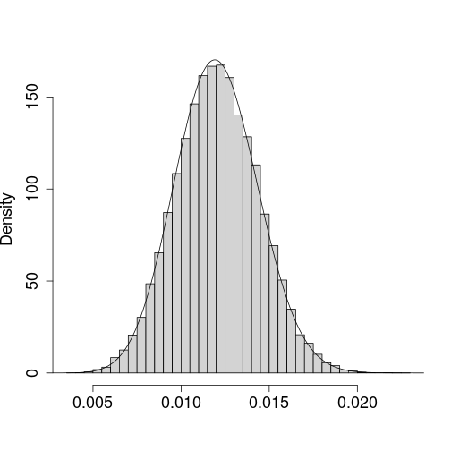

```r
# dev.off()

# beta
# pdf(file.path(plotpath,"beta-postplot.pdf"),width=7,height=7)
hist(stansamps$beta,freq=FALSE,breaks=50,main = "",xlab = "",cex.lab=1.5,cex.axis = 1.5)
with(quaddensbeta,lines(transparam,pdf_transparam))
```


```r
# dev.off()

# summary stats

moms <- compute_moment(quadmod,function(x) exp(x))
getks <- function(x,y) {
  suppressWarnings(capture.output(ks <- ks.test(x,y)))
  unname(ks$statistic)
}
M <- nrow(stansamps)

quadsamps <- sample_marginal(quadmod,M)

summstats <- data.frame(
  stat = c('mean','sd','q2.5','q97.5','KS'),
  alphamcmc = c(
    mean(stansamps$alpha),
    sd(stansamps$alpha),
    quantile(stansamps$alpha,c(.025,.975)),
    NA
  ),
  alphaaghq = c(
    moms[1],
    sqrt( compute_moment(quadmod$normalized_posterior,function(x) ( (exp(x)[1] - moms[1])^2 )) ),
    exp(compute_quantiles(quadmod$marginals[[1]])),
    getks(stansamps$`par[1]`,quadsamps[[1]])
  ),
  
  betamcmc = c(
    mean(stansamps$beta),
    sd(stansamps$beta),
    quantile(stansamps$beta,c(.025,.975)),
    NA
  ),
  betaaghq = c(
    moms[2],
    sqrt( compute_moment(quadmod$normalized_posterior,function(x) ( (exp(x)[2] - moms[2])^2 )) ),
    exp(compute_quantiles(quadmod$marginals[[2]])),
    getks(stansamps$`par[2]`,quadsamps[[2]])
  )
)

# readr::write_csv(summstats,file.path(plotpath,"summstattable.csv"))
knitr::kable(summstats,digits = 3)
```


|stat  | alphamcmc| alphaaghq| betamcmc| betaaghq|
|:-----|---------:|---------:|--------:|--------:|
|mean  |     0.012|     0.012|    1.306|    1.304|
|sd    |     0.002|     0.002|    0.155|    0.153|
|q2.5  |     0.008|     0.008|    0.982|    0.981|
|q97.5 |     0.017|     0.017|    1.590|    1.582|
|KS    |        NA|     0.019|       NA|    0.023|

```r
# Joint moment
compute_moment(
  quadmod,
  function(x) exp(x)[1] * 2^(-exp(x)[2])
)
```

```
## [1] 0.004804631
```

```r
mean(stansamps$alpha * 2^(-stansamps$beta))
```

```
## [1] 0.004809063
```

```r
#### END EXAMPLE 4.1 ####

if (doastro) {
## Example 4.2: Galactic Mass Estimation ----
  
  set.seed(563478)
  plotpath <- file.path(globalpath,"astro")
  if (!dir.exists(plotpath)) dir.create(plotpath)
  # the TMB template is part of the package. move it to a temp dir
  # for compiling since this generates a bunch of new files
  file.copy(system.file('extsrc/01_astro.cpp',package='aghq'),globalpath)
  
  # Compile TMB template-- only need to do once
  compile(file.path(globalpath,"01_astro.cpp"))
  
  data("gcdatalist",package = 'aghq')
  dyn.load(dynlib(file.path(globalpath,"01_astro")))
  
  
  # Function and its derivatives
  ff <- MakeADFun(data = gcdatalist,
                  parameters = list(theta1 = 0,
                                    theta2 = 0,
                                    theta3 = 0,
                                    theta4 = 0
                  ),
                  DLL = "01_astro",
                  ADreport = FALSE,
                  silent = TRUE)
  # Nonlinear constraints and their jacobian
  Es <- MakeADFun(data = gcdatalist,
                  parameters = list(theta1 = 0,
                                    theta2 = 0,
                                    theta3 = 0,
                                    theta4 = 0
                  ),
                  DLL = "01_astro",
                  ADreport = TRUE,
                  silent = TRUE)
  ## Parameter transformations ##
  parambounds <- list(
    Psi0 = c(1,200),
    gamma = c(.3,.7),
    alpha = c(3.0,3.7),
    beta = c(-.5,1)
  )
  
  get_psi0 <- function(theta) {
    # theta = -log( (Psi0 - 1) / (200 - 1) )
    (parambounds$Psi0[2] - parambounds$Psi0[1]) * 
      exp(-exp(theta)) + parambounds$Psi0[1]
  }
  get_theta1 <- function(Psi0) log(
    -log( 
      (Psi0 - parambounds$Psi0[1]) / (parambounds$Psi0[2] - parambounds$Psi0[1]) 
    )
  )
  
  get_gamma <- function(theta) {
    # theta = -log( (gamma - .3) / (.7 - .3) )
    (parambounds$gamma[2] - parambounds$gamma[1]) * 
      exp(-exp(theta)) + parambounds$gamma[1]
  }
  get_theta2 <- function(gamma) log(
    -log( 
      (gamma - parambounds$gamma[1]) / (parambounds$gamma[2] - parambounds$gamma[1]) 
    )
  )
  
  get_alpha <- function(theta) {
    # theta = log(alpha - 3)
    exp(theta) + parambounds$alpha[1]
  }
  get_theta3 <- function(alpha) log(alpha - parambounds$alpha[1])
  
  get_beta <- function(theta) {
    # theta = -log( (beta - (-.5)) / (1 - (-.5)) )
    (parambounds$beta[2] - parambounds$beta[1]) * 
      exp(-exp(theta)) + parambounds$beta[1]
  }
  get_theta4 <- function(beta) log(
    -log( 
      (beta - parambounds$beta[1]) / (parambounds$beta[2] - parambounds$beta[1]) 
    )
  )
  
  ## Optimization using IPOPT ##
  # The template returns the NEGATIVE log posterior
  # So leave these as negatives. IPOPT will minimize.
  ipopt_objective <- function(theta) ff$fn(theta)
  ipopt_objective_gradient <- function(theta) ff$gr(theta)
  ipopt_objective_hessian <- function(theta) {
    H <- forceSymmetric(ff$he(theta))
    H <- as(H,"dsTMatrix")
    H
  }
  ipopt_objective_hessian_x <- function(theta,obj_factor,hessian_lambda) 
    obj_factor * ipopt_objective_hessian(theta)@x
  ipopt_objective_hessian_structure <- function(theta) {
    H <- ipopt_objective_hessian(theta)
    H <- as(forceSymmetric(H),'dsTMatrix')
    forStruct = cbind(H@i+1, H@j+1)
    tapply(forStruct[,1], forStruct[,2], c)
  }
  
  
  # Box constraints, to improve stability of optimization
  lowerbounds <- c(
    get_theta1(parambounds$Psi0[2] - .001),
    get_theta2(parambounds$gamma[2] - .001),
    get_theta3(parambounds$alpha[1] + .001),
    get_theta4(parambounds$beta[2] - .001)
  )
  
  upperbounds <- c(
    get_theta1(parambounds$Psi0[1] + 1),
    get_theta2(parambounds$gamma[1] + .01),
    get_theta3(parambounds$alpha[2] - .01),
    get_theta4(parambounds$beta[1] + .01)
  )
  
  thetastart <- (lowerbounds + upperbounds)/2 # Start in the middle
  
  # Nonlinear constraints, specified as a function
  ipopt_nonlinear_constraints <- function(theta) Es$fn(theta)
  
  ipopt_nonlinear_constraints_jacobian <- function(theta) {
    J <- Es$gr(theta)
    as(J,"dgTMatrix")
  }
  ipopt_nonlinear_constraints_jacobian_x <- function(theta) 
    ipopt_nonlinear_constraints_jacobian(theta)@x
  ipopt_nonlinear_constraints_jacobian_structure <- function(theta) {
    J <- ipopt_nonlinear_constraints_jacobian(theta)
    J <- as(J,'dgTMatrix')
    forStruct = cbind(J@i+1, J@j+1)
    tapply(forStruct[,2], forStruct[,1], c)
  }
  
  nonlinear_lowerbound <- rep(0,nrow(gcdatalist$y)+2)
  nonlinear_upperbound <- rep(Inf,nrow(gcdatalist$y)+2)
  
  stopifnot(all(ipopt_nonlinear_constraints(thetastart) > 0))
  
  tm <- Sys.time()
  ipopt_result <- ipoptr::ipoptr(
    x0 = thetastart,
    eval_f = ipopt_objective,
    eval_grad_f = ipopt_objective_gradient,
    eval_h = ipopt_objective_hessian_x,
    eval_h_structure = ipopt_objective_hessian_structure(thetastart),
    eval_g = ipopt_nonlinear_constraints,
    eval_jac_g = ipopt_nonlinear_constraints_jacobian_x,
    eval_jac_g_structure = ipopt_nonlinear_constraints_jacobian_structure(thetastart),
    lb = lowerbounds,
    ub = upperbounds,
    constraint_lb = nonlinear_lowerbound,
    constraint_ub = nonlinear_upperbound,
    opts = list(obj_scaling_factor = 1,
                tol = 1e-03)
  )
  optruntime <- difftime(Sys.time(),tm,units = 'secs')
  cat('Run time for mass model optimization:',optruntime,'seconds.\n')
  
  ## AGHQ ----
  # Create the optimization template
  useropt <- list(
    ff = list(
      fn = function(theta) -1*ff$fn(theta),
      gr = function(theta) -1*ff$gr(theta),
      he = function(theta) -1*ff$he(theta)
    ),
    mode = ipopt_result$solution,
    hessian = ff$he(ipopt_result$solution)
  )
  # Do the quadrature
  tm <- Sys.time()
  astroquad <- aghq::aghq(ff,5,thetastart,optresults = useropt,control = default_control(negate=TRUE))
  quadruntime <- difftime(Sys.time(),tm,units = 'secs')
  cat("Run time for mass model quadrature:",quadruntime,"seconds.\n")
  
  # Total runtime
  aghqtime <- optruntime + quadruntime
  
  ## MCMC ----
  tm <- Sys.time()
  stanmod <- tmbstan(
    ff,
    chains = 4,
    cores = 4,
    iter = 1e04,
    warmup = 1e03,
    init = thetastart,
    seed = 48645,
    algorithm = "NUTS"
  )
  stantime <- difftime(Sys.time(),tm,units = 'secs')
  # Save the traceplot
  # pdf(file = file.path(plotpath,"stan-trace.pdf"),width = 7,height = 7)
  # traceplot(stanmod)
  # dev.off()
  
  ## TMB ----
  tm <- Sys.time()
  tmbsd <- TMB::sdreport(ff)
  tmbtime <- difftime(Sys.time(),tm,units = "secs")
  tmbsddat <- data.frame(var = paste0('theta',1:4),est = tmbsd$par.fixed,sd = sqrt(diag(tmbsd$cov.fixed)))
  rownames(tmbsddat) <- NULL
  
  # Times
  # AGHQ
  as.numeric(aghqtime) * stanmod@sim$iter / as.numeric(stantime)
  # TMB
  as.numeric(optruntime) * stanmod@sim$iter / as.numeric(stantime)
  
  
  # Redefine parameters functions for plotting
  get_psi0 <- function(theta)
    (parambounds$Psi0[2] - parambounds$Psi0[1]) * 
    exp(-exp(theta)) + parambounds$Psi0[1]
  get_theta1 <- function(Psi0) 
    log(-log( (Psi0 - parambounds$Psi0[1]) / 
                (parambounds$Psi0[2] - parambounds$Psi0[1]) ))
  
  get_gamma <- function(theta)  
    (parambounds$gamma[2] - parambounds$gamma[1]) * 
    exp(-exp(theta)) + parambounds$gamma[1]
  # Add a little buffer, for stability
  get_theta2 <- function(gamma) 
    log(-log( (gamma - parambounds$gamma[1] + 1e-03) / 
                (parambounds$gamma[2] - parambounds$gamma[1] + 1e-03) ))
  
  get_alpha <- function(theta)
    exp(theta) + parambounds$alpha[1]
  # Add a little buffer, for stability
  get_theta3 <- function(alpha) 
    log(alpha - parambounds$alpha[1] + 1e-03)
  
  
  get_beta <- function(theta)
    (parambounds$beta[2] - parambounds$beta[1]) * 
    exp(-exp(theta)) + parambounds$beta[1]
  get_theta4 <- function(beta) 
    log(-log( (beta - parambounds$beta[1]) / 
                (parambounds$beta[2] - parambounds$beta[1]) ))
  ## Compute the transformed pdfs ##
  translist1 <- list(totheta = get_theta1,fromtheta = get_psi0)
  translist2 <- list(totheta = get_theta2,fromtheta = get_gamma)
  translist3 <- list(totheta = get_theta3,fromtheta = get_alpha)
  translist4 <- list(totheta = get_theta4,fromtheta = get_beta)
  
  psi0pdf <- compute_pdf_and_cdf(astroquad$marginals[[1]],translist1)
  gammapdf <- compute_pdf_and_cdf(astroquad$marginals[[2]],translist2)
  alphapdf <- compute_pdf_and_cdf(astroquad$marginals[[3]],translist3)
  betapdf <- compute_pdf_and_cdf(astroquad$marginals[[4]],translist4)
  
  Psi0prior <- function(Psi0) dunif(Psi0,parambounds$Psi0[1],parambounds$Psi0[2],log = FALSE)
  gammaprior <- function(gamma) dunif(gamma,parambounds$gamma[1],parambounds$gamma[2],log = FALSE)
  alphaprior <- function(alpha) dgamma(alpha - parambounds$alpha[1],shape = 1,rate = 4.6,log = FALSE)
  betaprior <- function(beta) dunif(beta,parambounds$beta[1],parambounds$beta[2],log = FALSE)
  
  # STAN
  standata <- as.data.frame(stanmod)
  standata$psi0 <- get_psi0(standata[ ,1])
  standata$gamma <- get_gamma(standata[ ,2])
  standata$alpha <- get_alpha(standata[ ,3])
  standata$beta <- get_beta(standata[ ,4])
  
  # TMB
  tmbpsi0 <- data.frame(psi0 = psi0pdf$transparam,
                        pdf = dnorm(psi0pdf$theta,tmbsddat[1,2],tmbsddat[1,3]) * abs(numDeriv::grad(get_theta1,psi0pdf$transparam)))
  tmbgamma <- data.frame(gamma = gammapdf$transparam,
                         pdf = dnorm(gammapdf$theta,tmbsddat[2,2],tmbsddat[2,3]) * abs(numDeriv::grad(get_theta2,gammapdf$transparam)))
  tmbalpha <- data.frame(alpha = alphapdf$transparam,
                         pdf = dnorm(alphapdf$theta,tmbsddat[3,2],tmbsddat[3,3]) * abs(numDeriv::grad(get_theta3,alphapdf$transparam)))
  tmbbeta <- data.frame(beta = betapdf$transparam,
                        pdf = dnorm(betapdf$theta,tmbsddat[4,2],tmbsddat[4,3]) * abs(numDeriv::grad(get_theta4,betapdf$transparam)))
  
  
  # pdf(file.path(plotpath,"psi0-plot.pdf"),width = 7,height = 7)
  hist(standata$psi0,freq=FALSE,breaks=50,main = "",xlab = "",cex.lab=1.5,cex.axis = 1.5)
  with(psi0pdf,lines(transparam,pdf_transparam,lwd=2))
  with(psi0pdf,lines(transparam,Psi0prior(transparam),lty = 'dashed',lwd=2))
  with(tmbpsi0,lines(psi0,pdf,lty='dotdash',lwd=2))
  # dev.off()
  
  # pdf(file.path(plotpath,"gamma-plot.pdf"),width = 7,height = 7)
  hist(standata$gamma,freq=FALSE,breaks=50,main = "",xlab = "",cex.lab=1.5,cex.axis = 1.5)
  with(gammapdf,lines(transparam,pdf_transparam,lwd=2))
  with(gammapdf,lines(transparam,gammaprior(transparam),lty = 'dashed',lwd=2))
  with(tmbgamma,lines(gamma,pdf,lty='dotdash',lwd=2))
  # dev.off()
  
  # pdf(file.path(plotpath,"alpha-plot.pdf"),width = 7,height = 7)
  hist(standata$alpha,freq=FALSE,breaks=50,main = "",xlab = "",cex.lab=1.5,cex.axis = 1.5)
  with(alphapdf,lines(transparam,pdf_transparam,lwd=2))
  with(alphapdf,lines(transparam,alphaprior(transparam),lty = 'dashed',lwd=2))
  with(tmbalpha,lines(alpha,pdf,lty='dotdash',lwd=2))
  # dev.off()
  
  # pdf(file.path(plotpath,"beta-plot.pdf"),width = 7,height = 7)
  hist(standata$beta,freq=FALSE,breaks=50,main = "",xlab = "",cex.lab=1.5,cex.axis = 1.5)
  with(betapdf,lines(transparam,pdf_transparam,lwd=2))
  with(betapdf,lines(transparam,betaprior(transparam),lty = 'dashed',lwd=2))
  with(tmbbeta,lines(beta,pdf,lty='dotdash',lwd=2))
  # dev.off()
  
  # KS distances
  getks <- function(x,y) {
    suppressWarnings(capture.output(ks <- ks.test(x,y)))
    unname(ks$statistic)
  }
  M <- nrow(standata)
  
  aghqsamps <- sample_marginal(astroquad,M)
  
  psi0samps <- data.frame(
    mcmc = standata[ ,1],
    aghq = aghqsamps[[1]],
    tmb = rnorm(M,tmbsddat[1,2],tmbsddat[1,3])
  )
  gammasamps <- data.frame(
    mcmc = standata[ ,2],
    aghq = aghqsamps[[2]],
    tmb = rnorm(M,tmbsddat[2,2],tmbsddat[2,3])
  )
  alphasamps <- data.frame(
    mcmc = standata[ ,3],
    aghq = aghqsamps[[3]],
    tmb = rnorm(M,tmbsddat[3,2],tmbsddat[3,3])
  )
  betasamps <- data.frame(
    mcmc = standata[ ,4],
    aghq = aghqsamps[[4]],
    tmb = rnorm(M,tmbsddat[4,2],tmbsddat[4,3])
  )
  
  kstable <- data.frame(
    var = c('psi0','gamma','alpha','beta'),
    ks_aghq = c(
      getks(psi0samps$mcmc,psi0samps$aghq),
      getks(gammasamps$mcmc,gammasamps$aghq),
      getks(alphasamps$mcmc,alphasamps$aghq),
      getks(betasamps$mcmc,betasamps$aghq)
    ),
    ks_tmb = c(
      getks(psi0samps$mcmc,psi0samps$tmb),
      getks(gammasamps$mcmc,gammasamps$tmb),
      getks(alphasamps$mcmc,alphasamps$tmb),
      getks(betasamps$mcmc,betasamps$tmb)
    )
  )
  
  
  # readr::write_csv(kstable,file.path(plotpath,"astro-ks-table.csv"))
  knitr::kable(kstable,digits = 3)
  
  
  # Inference for the mass profile
  Mr <- function(r,theta) {
    p = get_psi0(theta[1])
    g = get_gamma(theta[2])
    
    # Manual unit conversion into "mass of one trillion suns" (so awesome)
    g*p*r^(1-g) * 2.325e09 * 1e-12
  }
  
  rtodo <- 1:150
  Mrout <- numeric(length(rtodo))
  Mrsdout <- numeric(length(rtodo))
  for (rr in 1:length(rtodo)) {
    r <- rtodo[rr]
    
    Mrout[rr] <- compute_moment(
      astroquad,
      function(x) Mr(r,x)
    )
    Mrsdout[rr] <- sqrt(compute_moment(
      astroquad,
      function(x) (Mr(r,x) - Mrout[rr])^2
    ))
  }
  # pdf(file.path(plotpath,"massplot-aghq.pdf"),width=7,height=7)
  plot(rtodo,Mrout,type='l',lwd=2,xlab="",ylab="",xaxt='n',cex.axis=1.5)
  title(ylab=bquote('M(r) ('~10^12~M[sun]~')'),cex.lab=1.5,line=2.3)
  axis(1,at=seq(0,150,by=25),cex.axis=1.5)
  lines(rtodo,Mrout - 2*Mrsdout,lty='dashed',lwd=2)
  lines(rtodo,Mrout + 2*Mrsdout,lty='dashed',lwd=2)
  # dev.off()
  
  # With MCMC
  Mrlist <- list()
  for (i in 1:length(rtodo)) Mrlist[[i]] <- apply(standata[ ,c(1,2)],1,function(x) Mr(rtodo[i],x))
  meanvals <- Reduce(c,Map(mean,Mrlist))
  lowervals <- Reduce(c,Map(quantile,Mrlist,probs = .025))
  uppervals <- Reduce(c,Map(quantile,Mrlist,probs = .975))
  
  
  # pdf(file.path(plotpath,"massplot-mcmc.pdf"),width=7,height=7)
  plot(rtodo,meanvals,type='l',lwd=2,xlab="",ylab="",xaxt='n',cex.axis=1.5)
  title(ylab=bquote('M(r) ('~10^12~M[sun]~')'),cex.lab=1.5,line=2.3)
  axis(1,at=seq(0,150,by=25),cex.axis=1.5)
  lines(rtodo,lowervals,lty='dashed',lwd=2)
  lines(rtodo,uppervals,lty='dashed',lwd=2)
  # dev.off()
  
  # Empirical RMSE
  sqrt(mean( (Mrout - meanvals)^2 )) # 0.0004119291
  sqrt(mean( ((Mrout - 2*Mrsdout) - lowervals)^2 )) # 0.007427573
  sqrt(mean( ((Mrout + 2*Mrsdout) - uppervals)^2 )) # 0.006063218
  
  #### END EXAMPLE 4.2 ####
}
```

```
## 
## ******************************************************************************
## This program contains Ipopt, a library for large-scale nonlinear optimization.
##  Ipopt is released as open source code under the Eclipse Public License (EPL).
##          For more information visit https://github.com/coin-or/Ipopt
## ******************************************************************************
## 
## This is Ipopt version 3.13.4, running with linear solver mumps.
## NOTE: Other linear solvers might be more efficient (see Ipopt documentation).
## 
## Number of nonzeros in equality constraint Jacobian...:        0
## Number of nonzeros in inequality constraint Jacobian.:      143
## Number of nonzeros in Lagrangian Hessian.............:       10
## 
## Total number of variables............................:        4
##                      variables with only lower bounds:        0
##                 variables with lower and upper bounds:        4
##                      variables with only upper bounds:        0
## Total number of equality constraints.................:        0
## Total number of inequality constraints...............:       72
##         inequality constraints with only lower bounds:       72
##    inequality constraints with lower and upper bounds:        0
##         inequality constraints with only upper bounds:        0
## 
## iter    objective    inf_pr   inf_du lg(mu)  ||d||  lg(rg) alpha_du alpha_pr  ls
##    0  8.6500412e+02 0.00e+00 5.38e+01  -1.0 0.00e+00    -  0.00e+00 0.00e+00   0
##    1  8.0734482e+02 0.00e+00 3.75e+00  -1.0 3.54e+00    -  5.59e-01 5.00e-01f  2
##    2  8.0533402e+02 0.00e+00 6.36e-01  -1.0 6.80e+00    -  6.33e-01 1.00e+00h  1
## Warning: Cutting back alpha due to evaluation error
##    3  7.9408914e+02 0.00e+00 1.01e+01  -1.0 3.52e+01  -2.0 3.00e-01 2.41e-01h  2
##    4  7.6409501e+02 0.00e+00 2.25e+01  -1.0 5.15e+01  -2.5 4.55e-01 9.61e-01h  1
##    5  7.6358394e+02 0.00e+00 2.53e+01  -1.0 9.98e+01    -  9.24e-01 1.35e-02h  1
##    6  7.5386705e+02 0.00e+00 6.84e+00  -1.0 9.97e+01    -  1.00e+00 8.28e-01h  1
##    7  7.5306386e+02 0.00e+00 1.59e+01  -1.0 3.89e+01    -  7.79e-01 1.16e-01h  1
##    8  7.4824023e+02 0.00e+00 2.41e+00  -1.0 3.63e+01    -  1.00e+00 1.00e+00h  1
##    9  7.4496566e+02 0.00e+00 4.61e+00  -1.0 1.13e+01    -  1.00e+00 1.00e+00h  1
## iter    objective    inf_pr   inf_du lg(mu)  ||d||  lg(rg) alpha_du alpha_pr  ls
##   10  7.4353781e+02 0.00e+00 1.21e+01  -1.0 8.88e+00    -  1.00e+00 1.00e+00h  1
##   11  7.4370536e+02 0.00e+00 2.04e+01  -1.0 6.72e+00    -  3.25e-01 1.00e+00h  1
##   12  7.4362787e+02 0.00e+00 7.83e+00  -1.0 4.91e+00    -  1.00e+00 1.00e+00h  1
##   13  7.4372858e+02 0.00e+00 6.86e-01  -1.0 1.95e+00    -  1.00e+00 1.00e+00h  1
##   14  7.4378472e+02 0.00e+00 1.02e-02  -1.0 8.10e-01    -  1.00e+00 1.00e+00h  1
##   15  7.4365448e+02 0.00e+00 1.06e+00  -1.7 2.25e+00    -  1.00e+00 1.00e+00h  1
##   16  7.4357828e+02 0.00e+00 5.61e-03  -1.7 1.08e+00    -  1.00e+00 1.00e+00h  1
##   17  7.4351133e+02 0.00e+00 3.34e-03  -1.7 1.22e-01    -  1.00e+00 1.00e+00h  1
##   18  7.4345552e+02 0.00e+00 3.26e-03  -1.7 1.13e-01    -  1.00e+00 1.00e+00h  1
##   19  7.4341121e+02 0.00e+00 2.94e-03  -1.7 1.44e-01    -  1.00e+00 1.00e+00h  1
## iter    objective    inf_pr   inf_du lg(mu)  ||d||  lg(rg) alpha_du alpha_pr  ls
##   20  7.4337805e+02 0.00e+00 2.38e-03  -1.7 1.83e-01    -  1.00e+00 1.00e+00h  1
##   21  7.4335496e+02 0.00e+00 1.65e-03  -1.7 2.19e-01    -  1.00e+00 1.00e+00h  1
##   22  7.4334010e+02 0.00e+00 9.46e-04  -1.7 2.36e-01    -  1.00e+00 1.00e+00h  1
##   23  7.4333121e+02 0.00e+00 4.38e-04  -1.7 2.18e-01    -  1.00e+00 1.00e+00h  1
##   24  7.4332615e+02 0.00e+00 1.70e-04  -1.7 1.68e-01    -  1.00e+00 1.00e+00h  1
##   25  7.4332334e+02 0.00e+00 5.92e-05  -1.7 1.11e-01    -  1.00e+00 1.00e+00h  1
##   26  7.4329578e+02 0.00e+00 5.04e-01  -2.5 1.13e+00    -  7.09e-01 1.00e+00h  1
##   27  7.4323398e+02 0.00e+00 2.73e-01  -2.5 8.92e+00    -  1.00e+00 5.46e-01h  1
##   28  7.4316925e+02 0.00e+00 2.90e-02  -2.5 7.28e-01    -  7.73e-01 1.00e+00h  1
##   29  7.4310353e+02 0.00e+00 3.53e-03  -2.5 3.80e-01    -  1.00e+00 1.00e+00h  1
## iter    objective    inf_pr   inf_du lg(mu)  ||d||  lg(rg) alpha_du alpha_pr  ls
##   30  7.4303952e+02 0.00e+00 3.98e-03  -2.5 3.11e-01    -  1.00e+00 1.00e+00h  1
##   31  7.4297515e+02 0.00e+00 4.21e-03  -2.5 5.73e-02    -  1.00e+00 1.00e+00h  1
##   32  7.4291021e+02 0.00e+00 4.45e-03  -2.5 5.44e-02    -  1.00e+00 1.00e+00h  1
##   33  7.4284464e+02 0.00e+00 4.70e-03  -2.5 5.45e-02    -  1.00e+00 1.00e+00h  1
##   34  7.4277841e+02 0.00e+00 4.96e-03  -2.5 5.45e-02    -  1.00e+00 1.00e+00h  1
##   35  7.4271147e+02 0.00e+00 5.24e-03  -2.5 5.46e-02    -  1.00e+00 1.00e+00h  1
##   36  7.4264379e+02 0.00e+00 5.54e-03  -2.5 5.46e-02    -  1.00e+00 1.00e+00h  1
##   37  7.4257532e+02 0.00e+00 5.85e-03  -2.5 5.47e-02    -  1.00e+00 1.00e+00h  1
##   38  7.4250601e+02 0.00e+00 6.18e-03  -2.5 5.47e-02    -  1.00e+00 1.00e+00h  1
##   39  7.4243583e+02 0.00e+00 6.53e-03  -2.5 5.48e-02    -  1.00e+00 1.00e+00h  1
## iter    objective    inf_pr   inf_du lg(mu)  ||d||  lg(rg) alpha_du alpha_pr  ls
##   40  7.4236473e+02 0.00e+00 6.89e-03  -2.5 5.48e-02    -  1.00e+00 1.00e+00h  1
##   41  7.4229265e+02 0.00e+00 7.28e-03  -2.5 5.48e-02    -  1.00e+00 1.00e+00h  1
##   42  7.4221954e+02 0.00e+00 7.69e-03  -2.5 5.49e-02    -  1.00e+00 1.00e+00h  1
##   43  7.4214534e+02 0.00e+00 8.12e-03  -2.5 5.49e-02    -  1.00e+00 1.00e+00h  1
##   44  7.4207000e+02 0.00e+00 8.57e-03  -2.5 5.50e-02    -  1.00e+00 1.00e+00h  1
##   45  7.4199346e+02 0.00e+00 9.05e-03  -2.5 5.51e-02    -  1.00e+00 1.00e+00h  1
##   46  7.4191563e+02 0.00e+00 9.55e-03  -2.5 5.51e-02    -  1.00e+00 1.00e+00h  1
##   47  7.4183647e+02 0.00e+00 1.01e-02  -2.5 5.51e-02    -  1.00e+00 1.00e+00h  1
##   48  7.4175589e+02 0.00e+00 1.06e-02  -2.5 5.52e-02    -  1.00e+00 1.00e+00h  1
##   49  7.4167382e+02 0.00e+00 1.12e-02  -2.5 5.52e-02    -  1.00e+00 1.00e+00h  1
## iter    objective    inf_pr   inf_du lg(mu)  ||d||  lg(rg) alpha_du alpha_pr  ls
##   50  7.4159018e+02 0.00e+00 1.18e-02  -2.5 5.53e-02    -  1.00e+00 1.00e+00h  1
##   51  7.4150488e+02 0.00e+00 1.25e-02  -2.5 5.54e-02    -  1.00e+00 1.00e+00h  1
##   52  7.4141784e+02 0.00e+00 1.32e-02  -2.5 5.85e-02    -  1.00e+00 1.00e+00h  1
##   53  7.4132895e+02 0.00e+00 1.39e-02  -2.5 6.18e-02    -  1.00e+00 1.00e+00h  1
##   54  7.4123813e+02 0.00e+00 1.46e-02  -2.5 6.53e-02    -  1.00e+00 1.00e+00h  1
##   55  7.4114526e+02 0.00e+00 1.54e-02  -2.5 6.89e-02    -  1.00e+00 1.00e+00h  1
##   56  7.4105025e+02 0.00e+00 1.62e-02  -2.5 7.27e-02    -  1.00e+00 1.00e+00h  1
##   57  7.4095297e+02 0.00e+00 1.71e-02  -2.5 7.68e-02    -  1.00e+00 1.00e+00h  1
##   58  7.4085330e+02 0.00e+00 1.80e-02  -2.5 8.11e-02    -  1.00e+00 1.00e+00h  1
##   59  7.4075113e+02 0.00e+00 1.90e-02  -2.5 8.55e-02    -  1.00e+00 1.00e+00h  1
## iter    objective    inf_pr   inf_du lg(mu)  ||d||  lg(rg) alpha_du alpha_pr  ls
##   60  7.4064631e+02 0.00e+00 1.99e-02  -2.5 9.03e-02    -  1.00e+00 1.00e+00h  1
##   61  7.4053871e+02 0.00e+00 2.10e-02  -2.5 9.52e-02    -  1.00e+00 1.00e+00h  1
##   62  7.4042819e+02 0.00e+00 2.20e-02  -2.5 1.00e-01    -  1.00e+00 1.00e+00h  1
##   63  7.4031459e+02 0.00e+00 2.31e-02  -2.5 1.06e-01    -  1.00e+00 1.00e+00h  1
##   64  7.4019776e+02 0.00e+00 2.43e-02  -2.5 1.12e-01    -  1.00e+00 1.00e+00h  1
##   65  7.4007754e+02 0.00e+00 2.55e-02  -2.5 1.18e-01    -  1.00e+00 1.00e+00h  1
##   66  7.3995374e+02 0.00e+00 2.67e-02  -2.5 1.24e-01    -  1.00e+00 1.00e+00h  1
##   67  7.3982619e+02 0.00e+00 2.80e-02  -2.5 1.31e-01    -  1.00e+00 1.00e+00h  1
##   68  7.3969470e+02 0.00e+00 2.94e-02  -2.5 1.38e-01    -  1.00e+00 1.00e+00h  1
##   69  7.3955909e+02 0.00e+00 3.07e-02  -2.5 1.45e-01    -  1.00e+00 1.00e+00h  1
## iter    objective    inf_pr   inf_du lg(mu)  ||d||  lg(rg) alpha_du alpha_pr  ls
##   70  7.3941913e+02 0.00e+00 3.21e-02  -2.5 1.53e-01    -  1.00e+00 1.00e+00h  1
##   71  7.3927463e+02 0.00e+00 3.36e-02  -2.5 1.61e-01    -  1.00e+00 1.00e+00h  1
##   72  7.3912536e+02 0.00e+00 3.51e-02  -2.5 1.69e-01    -  1.00e+00 1.00e+00h  1
##   73  7.3897110e+02 0.00e+00 3.66e-02  -2.5 1.78e-01    -  1.00e+00 1.00e+00h  1
##   74  7.3881160e+02 0.00e+00 3.82e-02  -2.5 1.87e-01    -  1.00e+00 1.00e+00h  1
##   75  7.3864664e+02 0.00e+00 3.98e-02  -2.5 1.97e-01    -  1.00e+00 1.00e+00h  1
##   76  7.3847595e+02 0.00e+00 4.14e-02  -2.5 2.07e-01    -  1.00e+00 1.00e+00h  1
##   77  7.3829927e+02 0.00e+00 4.30e-02  -2.5 2.17e-01    -  1.00e+00 1.00e+00h  1
##   78  7.3811635e+02 0.00e+00 4.47e-02  -2.5 2.28e-01    -  1.00e+00 1.00e+00h  1
##   79  7.3792689e+02 0.00e+00 4.64e-02  -2.5 2.39e-01    -  1.00e+00 1.00e+00h  1
## iter    objective    inf_pr   inf_du lg(mu)  ||d||  lg(rg) alpha_du alpha_pr  ls
##   80  7.3773062e+02 0.00e+00 4.80e-02  -2.5 2.51e-01    -  1.00e+00 1.00e+00h  1
##   81  7.3752724e+02 0.00e+00 4.97e-02  -2.5 2.63e-01    -  1.00e+00 1.00e+00h  1
##   82  7.3731647e+02 0.00e+00 5.14e-02  -2.5 2.75e-01    -  1.00e+00 1.00e+00h  1
##   83  7.3709798e+02 0.00e+00 5.31e-02  -2.5 2.88e-01    -  1.00e+00 1.00e+00h  1
##   84  7.3687147e+02 0.00e+00 5.47e-02  -2.5 3.02e-01    -  1.00e+00 1.00e+00h  1
##   85  7.3663663e+02 0.00e+00 5.64e-02  -2.5 3.15e-01    -  1.00e+00 1.00e+00h  1
##   86  7.3639312e+02 0.00e+00 5.80e-02  -2.5 3.29e-01    -  1.00e+00 1.00e+00h  1
##   87  7.3614062e+02 0.00e+00 5.95e-02  -2.5 3.44e-01    -  1.00e+00 1.00e+00h  1
##   88  7.3587879e+02 0.00e+00 6.10e-02  -2.5 3.59e-01    -  1.00e+00 1.00e+00h  1
##   89  7.3560730e+02 0.00e+00 6.25e-02  -2.5 3.75e-01    -  1.00e+00 1.00e+00h  1
## iter    objective    inf_pr   inf_du lg(mu)  ||d||  lg(rg) alpha_du alpha_pr  ls
##   90  7.3532580e+02 0.00e+00 6.39e-02  -2.5 3.90e-01    -  1.00e+00 1.00e+00h  1
##   91  7.3503394e+02 0.00e+00 6.51e-02  -2.5 4.07e-01    -  1.00e+00 1.00e+00h  1
##   92  7.3473139e+02 0.00e+00 6.63e-02  -2.5 4.23e-01    -  1.00e+00 1.00e+00h  1
##   93  7.3441779e+02 0.00e+00 6.74e-02  -2.5 4.40e-01    -  1.00e+00 1.00e+00h  1
##   94  7.3409279e+02 0.00e+00 6.84e-02  -2.5 4.57e-01    -  1.00e+00 1.00e+00h  1
##   95  7.3375604e+02 0.00e+00 6.92e-02  -2.5 4.75e-01    -  1.00e+00 1.00e+00h  1
##   96  7.3340719e+02 0.00e+00 6.99e-02  -2.5 4.92e-01    -  1.00e+00 1.00e+00h  1
##   97  7.3304589e+02 0.00e+00 7.05e-02  -2.5 5.10e-01    -  1.00e+00 1.00e+00h  1
##   98  7.3267179e+02 0.00e+00 7.09e-02  -2.5 5.28e-01    -  1.00e+00 1.00e+00h  1
##   99  7.3228455e+02 0.00e+00 7.11e-02  -2.5 5.47e-01    -  1.00e+00 1.00e+00h  1
## iter    objective    inf_pr   inf_du lg(mu)  ||d||  lg(rg) alpha_du alpha_pr  ls
##  100  7.3188382e+02 0.00e+00 7.11e-02  -2.5 5.65e-01    -  1.00e+00 1.00e+00h  1
##  101  7.3146927e+02 0.00e+00 7.09e-02  -2.5 5.83e-01    -  1.00e+00 1.00e+00h  1
##  102  7.3104054e+02 0.00e+00 7.05e-02  -2.5 6.02e-01    -  1.00e+00 1.00e+00h  1
##  103  7.3059733e+02 0.00e+00 6.98e-02  -2.5 6.20e-01    -  1.00e+00 1.00e+00h  1
##  104  7.3013929e+02 0.00e+00 6.89e-02  -2.5 6.39e-01    -  1.00e+00 1.00e+00h  1
##  105  7.2966609e+02 0.00e+00 6.77e-02  -2.5 6.57e-01    -  1.00e+00 1.00e+00h  1
##  106  7.2917743e+02 0.00e+00 6.63e-02  -2.5 6.75e-01    -  1.00e+00 1.00e+00h  1
##  107  7.2867299e+02 0.00e+00 6.45e-02  -2.5 6.93e-01    -  1.00e+00 1.00e+00h  1
##  108  7.2815245e+02 0.00e+00 6.24e-02  -2.5 7.11e-01    -  1.00e+00 1.00e+00h  1
##  109  7.2761550e+02 0.00e+00 5.99e-02  -2.5 7.28e-01    -  1.00e+00 1.00e+00h  1
## iter    objective    inf_pr   inf_du lg(mu)  ||d||  lg(rg) alpha_du alpha_pr  ls
##  110  7.2706185e+02 0.00e+00 5.71e-02  -2.5 7.45e-01    -  1.00e+00 1.00e+00h  1
##  111  7.2649118e+02 0.00e+00 5.39e-02  -2.5 7.62e-01    -  1.00e+00 1.00e+00h  1
##  112  7.2590320e+02 0.00e+00 5.02e-02  -2.5 7.78e-01    -  1.00e+00 1.00e+00h  1
##  113  7.2529762e+02 0.00e+00 4.61e-02  -2.5 7.93e-01    -  1.00e+00 1.00e+00h  1
##  114  7.2467414e+02 0.00e+00 4.14e-02  -2.5 8.08e-01    -  1.00e+00 1.00e+00h  1
##  115  7.2403245e+02 0.00e+00 3.62e-02  -2.5 8.23e-01    -  1.00e+00 1.00e+00h  1
##  116  7.2337227e+02 0.00e+00 3.03e-02  -2.5 8.36e-01    -  1.00e+00 1.00e+00h  1
##  117  7.2269331e+02 0.00e+00 2.38e-02  -2.5 8.49e-01    -  1.00e+00 1.00e+00h  1
##  118  7.2199527e+02 0.00e+00 1.64e-02  -2.5 8.61e-01    -  1.00e+00 1.00e+00h  1
##  119  7.2127788e+02 0.00e+00 8.21e-03  -2.5 8.72e-01    -  1.00e+00 1.00e+00h  1
## iter    objective    inf_pr   inf_du lg(mu)  ||d||  lg(rg) alpha_du alpha_pr  ls
##  120  7.2054088e+02 0.00e+00 7.00e-03  -2.5 8.82e-01    -  1.00e+00 1.00e+00h  1
##  121  7.1978402e+02 0.00e+00 1.13e-02  -2.5 8.91e-01    -  1.00e+00 1.00e+00h  1
##  122  7.1900709e+02 0.00e+00 2.29e-02  -2.5 8.98e-01    -  1.00e+00 1.00e+00h  1
##  123  7.1820996e+02 0.00e+00 3.59e-02  -2.5 9.04e-01    -  1.00e+00 1.00e+00h  1
##  124  7.1739257e+02 0.00e+00 5.06e-02  -2.5 9.09e-01    -  1.00e+00 1.00e+00h  1
##  125  7.1655503e+02 0.00e+00 6.73e-02  -2.5 9.12e-01    -  1.00e+00 1.00e+00h  1
##  126  7.1569764e+02 0.00e+00 8.62e-02  -2.5 9.13e-01    -  1.00e+00 1.00e+00h  1
##  127  7.1482101e+02 0.00e+00 1.08e-01  -2.5 9.11e-01    -  1.00e+00 1.00e+00h  1
##  128  7.1392624e+02 0.00e+00 1.32e-01  -2.5 9.08e-01    -  1.00e+00 1.00e+00h  1
##  129  7.1301504e+02 0.00e+00 1.60e-01  -2.5 9.01e-01    -  1.00e+00 1.00e+00h  1
## iter    objective    inf_pr   inf_du lg(mu)  ||d||  lg(rg) alpha_du alpha_pr  ls
##  130  7.1209009e+02 0.00e+00 1.91e-01  -2.5 8.90e-01    -  1.00e+00 1.00e+00h  1
##  131  7.1115540e+02 0.00e+00 2.26e-01  -2.5 8.75e-01    -  1.00e+00 1.00e+00h  1
##  132  7.1021685e+02 0.00e+00 2.64e-01  -2.5 8.54e-01    -  1.00e+00 1.00e+00h  1
##  133  7.0928289e+02 0.00e+00 3.05e-01  -2.5 8.26e-01    -  1.00e+00 1.00e+00h  1
##  134  7.0836548e+02 0.00e+00 3.45e-01  -2.5 7.91e-01    -  1.00e+00 1.00e+00h  1
##  135  7.0748110e+02 0.00e+00 3.80e-01  -2.5 7.46e-01    -  1.00e+00 1.00e+00h  1
##  136  7.0665179e+02 0.00e+00 4.01e-01  -2.5 6.89e-01    -  1.00e+00 1.00e+00h  1
##  137  7.0590581e+02 0.00e+00 3.96e-01  -2.5 6.20e-01    -  1.00e+00 1.00e+00h  1
##  138  7.0527715e+02 0.00e+00 3.50e-01  -2.5 5.40e-01    -  1.00e+00 1.00e+00h  1
##  139  7.0480303e+02 0.00e+00 2.54e-01  -2.5 4.57e-01    -  1.00e+00 1.00e+00h  1
## iter    objective    inf_pr   inf_du lg(mu)  ||d||  lg(rg) alpha_du alpha_pr  ls
##  140  7.0451848e+02 0.00e+00 1.14e-01  -2.5 4.60e-01    -  1.00e+00 1.00e+00h  1
##  141  7.0444099e+02 0.00e+00 3.86e-02  -2.5 7.56e-01    -  3.08e-01 1.00e+00h  1
##  142  7.0439755e+02 0.00e+00 7.04e-03  -2.5 1.12e+01    -  2.40e-01 1.00e+00h  1
##  143  7.0436765e+02 0.00e+00 5.55e-03  -2.5 1.36e+00    -  1.00e+00 1.00e+00h  1
##  144  7.0434392e+02 0.00e+00 2.58e-03  -2.5 2.80e+00    -  1.00e+00 1.00e+00h  1
##  145  7.0432595e+02 0.00e+00 2.20e-03  -2.5 1.88e-01    -  1.00e+00 1.00e+00h  1
##  146  7.0431377e+02 0.00e+00 1.69e-03  -2.5 2.69e-01    -  1.00e+00 1.00e+00h  1
##  147  7.0430685e+02 0.00e+00 9.95e-04  -2.5 4.37e-01    -  1.00e+00 1.00e+00h  1
##  148  7.0430388e+02 0.00e+00 3.21e-04  -2.5 6.06e-01    -  1.00e+00 1.00e+00h  1
##  149  7.0430298e+02 0.00e+00 6.81e-05  -2.5 4.94e-01    -  1.00e+00 1.00e+00h  1
## iter    objective    inf_pr   inf_du lg(mu)  ||d||  lg(rg) alpha_du alpha_pr  ls
##  150  7.0430272e+02 0.00e+00 1.83e-05  -2.5 1.84e-01    -  1.00e+00 1.00e+00h  1
##  151  7.0430264e+02 0.00e+00 6.17e-06  -2.5 5.08e-02    -  1.00e+00 1.00e+00h  1
##  152  7.0429673e+02 0.00e+00 2.58e-03  -3.8 1.79e+00    -  1.00e+00 1.00e+00h  1
##  153  7.0429602e+02 0.00e+00 5.03e-04  -3.8 1.37e+00    -  9.17e-01 1.00e+00h  1
##  154  7.0429604e+02 0.00e+00 2.37e-05  -3.8 1.28e+00    -  1.00e+00 1.00e+00h  1
##  155  7.0429603e+02 0.00e+00 8.90e-07  -3.8 2.55e-01    -  1.00e+00 1.00e+00h  1
##  156  7.0429603e+02 0.00e+00 5.27e-08  -3.8 3.42e-02    -  1.00e+00 1.00e+00h  1
##  157  7.0429603e+02 0.00e+00 1.50e-09  -3.8 4.69e-03    -  1.00e+00 1.00e+00h  1
##  158  7.0429601e+02 0.00e+00 1.19e-05  -5.0 1.18e-01    -  1.00e+00 1.00e+00h  1
## 
## Number of Iterations....: 158
## 
##                                    (scaled)                 (unscaled)
## Objective...............:   7.0429600951775024e+02    7.0429600951775024e+02
## Dual infeasibility......:   1.1867880423488170e-05    1.1867880423488170e-05
## Constraint violation....:   0.0000000000000000e+00    0.0000000000000000e+00
## Complementarity.........:   1.4984177986315354e-05    1.4984177986315354e-05
## Overall NLP error.......:   1.4984177986315354e-05    1.4984177986315354e-05
## 
## 
## Number of objective function evaluations             = 163
## Number of objective gradient evaluations             = 159
## Number of equality constraint evaluations            = 0
## Number of inequality constraint evaluations          = 163
## Number of equality constraint Jacobian evaluations   = 0
## Number of inequality constraint Jacobian evaluations = 159
## Number of Lagrangian Hessian evaluations             = 158
## Total CPU secs in IPOPT (w/o function evaluations)   =      0.096
## Total CPU secs in NLP function evaluations           =      0.533
## 
## EXIT: Optimal Solution Found.
## Run time for mass model optimization: 0.8150125 seconds.
## Run time for mass model quadrature: 0.2619121 seconds.
```

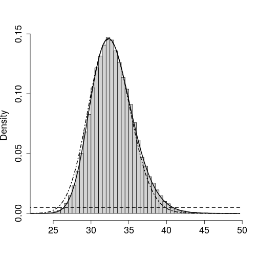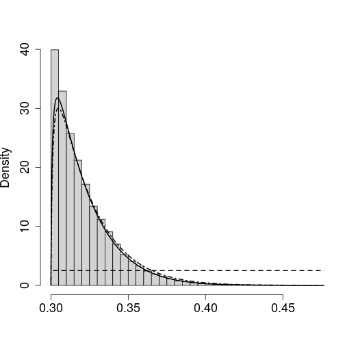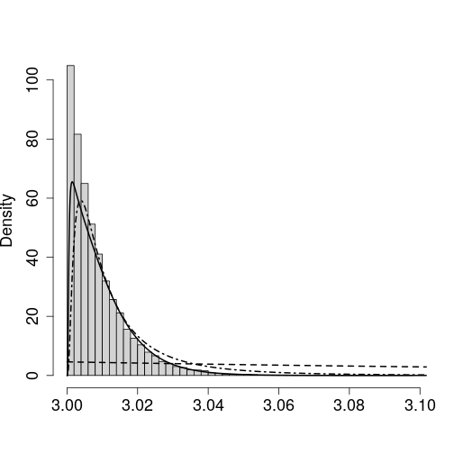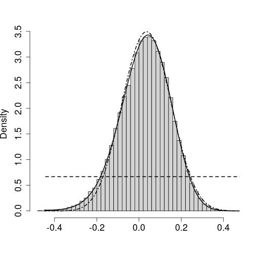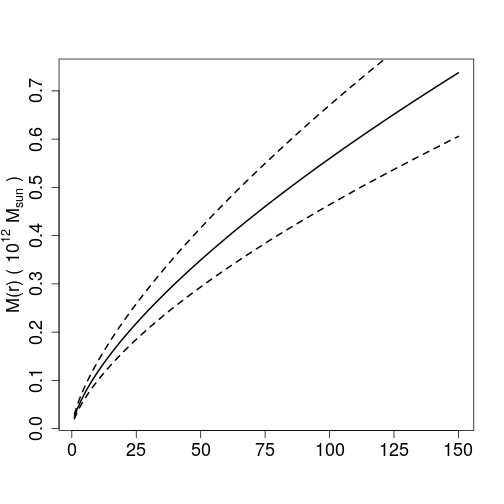

```
## [1] 0.006063218
```

```r
## Example 5.1: Loaloa, without zero-inflation ----


ilogit <- function(x) 1 / (1 + exp(-x))

set.seed(78968)

# Set flags
savestamp <- "20210504-v1"
plotpath <- file.path(globalpath,"loaloa")
if (!dir.exists(plotpath)) dir.create(plotpath)
savepath <- plotpath

# Initialize time variables
aghqtime <- 0
inlatime <- 0
mcmltime <- 0
mcmctime <- 0

aghqsimtime <- 0
mcmlsimtime <- 0
mcmcsimtime <- 0

## Load the data ##
# loaloa data appears in two packages
data(loaloa,package = "PrevMap")
loaloa2 <- loaloa
rm(loaloa)
data(loaloa,package = "geostatsp")

## Prepare the "inner" model ##

# Design matrices
Amat <- Diagonal(nrow(loaloa))

design <- cbind(Amat,rep(1,nrow(Amat))) # No covariates, for comparison
# Response
y <- loaloa@data$y
N <- loaloa@data$N

## Dimensions
n <- nrow(design)
p <- 1
m <- ncol(Amat)
Wd <- ncol(design)

## Prior distributions ##
sigma_u <- 1
sigma_alpha <- .025
rho_u <- 2e05
rho_alpha <- .975
# rho is "range", WITH the sqrt(8*nu) factor. So PC prior is exponential on 1/rho

# PC Prior for kappa,tau
maternconstants <- list()
maternconstants$d <- 2 # Dimension of spatial field, fixed
maternconstants$nu <- 1 # Shape param, fixed
get_kappa <- function(sigma,rho)
  sqrt(8*maternconstants$nu)/rho
get_tau <- function(sigma,rho)
  sigma * get_kappa(sigma,rho)^(maternconstants$nu) *
  sqrt(gamma(maternconstants$nu +
               maternconstants$d/2) *
         (4*pi)^(maternconstants$d/2) /
         gamma(maternconstants$nu))
get_sigma <- function(kappa,tau)
  tau /
  (kappa^(maternconstants$nu) *
     sqrt(gamma(maternconstants$nu +
                  maternconstants$d/2) *
            (4*pi)^(maternconstants$d/2) /
            gamma(maternconstants$nu)))
get_rho <- function(kappa,tau)
  sqrt(8*maternconstants$nu) / kappa

log_prior_theta <- function(theta) {
  # theta = (log(kappa),log(tau))
  kappa <- exp(theta[1])
  tau <- exp(theta[2])
  
  lambda1 <- -(rho_u / sqrt(8*maternconstants$nu)) ^
    (maternconstants$d/2) * log(rho_alpha)
  lambda2 <- -kappa^(-maternconstants$nu) *
    sqrt( gamma(maternconstants$nu) /
            ( gamma(maternconstants$nu +
                      maternconstants$d/2) *
                (4*pi)^(maternconstants$d/2) ) ) *
    log(sigma_alpha) / sigma_u
  
  log(maternconstants$d) -
    log(2) +
    log(lambda1) +
    log(lambda2) +
    (maternconstants$d/2 - 1) *
    log(kappa) -
    lambda1 *
    kappa^(maternconstants$d/2) -
    lambda2 * tau +
    sum(theta)
}

beta_prec <- .001

Q_matrix <- function(theta) {
  # theta = log(kappa), log(tau)
  
  kappa <- as.numeric(unname(exp(theta[1])))
  tau <- as.numeric(unname(exp(theta[2])))
  
  sig <- get_sigma(kappa,tau)
  rho <- get_rho(kappa,tau)
  
  # Matern
  mm <- geostatsp::matern(
    loaloa,
    param = c("variance" = sig^2,"range" = rho,"shape" = maternconstants$nu),
    type = "precision"
  )
  
  bb <- beta_prec * Diagonal(p)
  
  rbind(
    cbind(mm,Matrix(0,nrow = nrow(mm),ncol = p,sparse = FALSE)),
    cbind(Matrix(0,nrow = p,ncol = ncol(mm),sparse = FALSE),bb)
  )
}

log_prior_W <- function(W,theta,Q = NULL) {
  if (is.null(Q)) Q <- Q_matrix(theta)
  -(1/2) * as.numeric(crossprod(W,crossprod(Q,W))) + 
      .5 * determinant(Q,logarithm=TRUE)$modulus
}

## Likelihood ----

make_eta <- function(W) as.numeric(design %*% W)

logit <- function(x) log((x) / (1-x))
ilogit <- function(x) 1 / (1 + exp(-x))

log_likelihood <- function(W) {
  eta <- make_eta(W)
  p <- ilogit(eta)
  sum(y * log(p) + (N - y) * log(1 - p))
}

grad_log_likelihood <- function(W) {
  eta <- make_eta(W)
  p <- ilogit(eta)
  y - N * p
}

# NEGATIVE hessian
hessian_log_likelihood <- function(W) {
  eta <- make_eta(W)
  p <- ilogit(eta)
  Diagonal(length(N),N * p * (1-p))
}

## Posterior

log_posterior_W <- function(W,theta,Q = NULL) {
  if (is.null(Q)) Q <- Q_matrix(theta)
  log_prior_W(W,theta,Q) + log_likelihood(W)
}

grad_log_posterior_W <- function(W,theta,Q = NULL) {
  if (is.null(Q)) Q <- Q_matrix(theta)
  as.numeric(-Q %*% cbind(W) + t(design) %*% grad_log_likelihood(W))
}

H_matrix <- function(W,theta,Q = NULL) {
  # minus the hessian of the log posterior
  CE <- hessian_log_likelihood(W)
  if (is.null(Q)) Q <- Q_matrix(theta)
  
  CW <- crossprod(design,crossprod(CE,design))
  
  as(Q + CW,"dgCMatrix")
}

# Simulate the spatial fields
simulate_spatial_fields <- function(U,
                                    theta,
                                    pointsdata,
                                    resolution = list(nrow = 100,ncol = 100)) {
  # U: matrix of samples, each column is a sample
  # theta: data.frame of theta values
  # Draw from U*|U
  
  # Compute matrix of var, range, shape
  modpar <- cbind(
    var = get_sigma(exp(theta$theta1),exp(theta$theta2))^2,
    range = get_rho(exp(theta$theta1),exp(theta$theta2)),
    shape = maternconstants$nu
  )
  
  fielddat <- pointsdata
  fielddat@data <- as.data.frame(U)
  
  geostatsp::RFsimulate(
    model = modpar,
    data = fielddat,
    x = raster(fielddat,nrows = resolution$nrow,ncols = resolution$ncol)
  )
  
}

## AGHQ ----

log_posterior_joint <- function(W,theta) {
  Q <- Q_matrix(theta) # Prior precision matrix
  log_prior_theta(theta) + log_prior_W(W,theta,Q) + log_likelihood(W)
}

ff <- list(
  fn = log_posterior_joint,
  gr = grad_log_posterior_W,
  he = function(W,theta) -1 * H_matrix(W,theta)
)

# Starting values taken from Brown (2011)
startingsig <- .988
startingrho <- 4.22*1e04
startingtheta <- c(
  log(get_kappa(startingsig,startingrho)),
  log(get_tau(startingsig,startingrho))
)
Wdim <- dim(Q_matrix(c(0,0)))[1]

# AGHQ
tm <- Sys.time()
cat("Doing AGHQ, time = ",format(tm),"\n")
```

```
## Doing AGHQ, time =  2021-05-13 17:00:55
```

```r
loaloaquad <- aghq::marginal_laplace(
  ff,
  5,
  list(W = rep(0,Wdim),theta = startingtheta)
)
aghqtime <- difftime(Sys.time(),tm,units = 'secs')
# save(loaloaquad,file = file.path(savepath,paste0("loaloaquad",savestamp,".RData")))
cat("AGHQ took: ",format(aghqtime),"\n")
```

```
## AGHQ took:  107.1509 secs
```

```r
# Spatial interpolation for AGHQ
tm <- Sys.time()
cat("Doing AGHQ simulation, time = ",format(tm),"\n")
```

```
## Doing AGHQ simulation, time =  2021-05-13 17:02:42
```

```r
samps <- sample_marginal(loaloaquad,1e02) # very fast

# predictions (prevalence)
UU <- samps$samps[1:190, ]
beta <- samps$samps[191, ]

simbrick <- simulate_spatial_fields(
  U = UU,
  theta = samps$theta,
  pointsdata = loaloa,
  resolution = list(nrow = 25,ncol = 50)
)
```

```
## New output format of RFsimulate: S4 object of class 'RFsp';
## for a bare, but faster array format use 'RFoptions(spConform=FALSE)'.
```

```r
simbrick <- simbrick + beta
aghqsimtime <- difftime(Sys.time(),tm,units = 'secs')
# raster::writeRaster(simbrick,file = file.path(savepath,paste0("loaloa-simbrick-aghq",savestamp,".grd")),overwrite = TRUE)
cat("AGHQ simulation took: ",format(aghqsimtime),"\n")
```

```
## AGHQ simulation took:  90.63154 secs
```

```r
## INLA ----
# Using geostatsp::glgm()

tm <- Sys.time()
cat("Doing INLA, time = ",format(tm),"\n")
```

```
## Doing INLA, time =  2021-05-13 17:04:12
```

```r
loaFit = glgm(formula = y ~ 1,
              data = loaloa, grid = 50,
              family = "binomial",
              Ntrials = loaloa$N, shape = maternconstants$nu, buffer = 1e05,
              prior = list(sd = c(u = sigma_u, alpha = sigma_alpha), range = c(u = rho_u, alpha = rho_alpha))) 
```

```
## Warning in proj4string(x): CRS object has comment, which is lost in output
```

```r
inlatime <- difftime(Sys.time(),tm,units = 'secs')
# save(loaFit,file = file.path(savepath,paste0("loaloainla",savestamp,".RData")))
cat("INLA took: ",format(inlatime),"\n")
```

```
## INLA took:  40.17739 secs
```

```r
# prediction
# Border for Cameroon and Nigeria
cameroonBorderLL = raster::getData("GADM", country=c('CMR'), level=2)
nigeriaBorderLL = raster::getData("GADM", country=c('NGA'), level=2)
cameroonBorder = spTransform(cameroonBorderLL, projection(loaloa))
nigeriaBorder = spTransform(nigeriaBorderLL, projection(loaloa))
cameroonBorderouter <- rgeos::gUnaryUnion(cameroonBorder)
nigeriaBorderouter <- rgeos::gUnaryUnion(nigeriaBorder)


fullborder <- raster::bind(cameroonBorder,nigeriaBorder)
fullborderouter <- raster::bind(cameroonBorderouter,nigeriaBorderouter)

fullborder <- crop(fullborder,loaloa)
fullborderouter <- crop(fullborderouter,loaloa)

plot_loaloa <- function(plotraster,breaks) {
  predcols <- mapmisc::colourScale(
    plotraster,
    breaks = breaks,
    style = "fixed",
    col = "Spectral",
    rev = TRUE
  )
  
  plotraster <- mask(plotraster,fullborderouter)
  
  mapmisc::map.new(loaloa)
  plot(plotraster,
       col = predcols$col,
       breaks = predcols$breaks,
       legend=FALSE, add=TRUE)
  points(loaloa,pch = 4)
  plot(fullborder,add = TRUE,border=mapmisc::col2html("black", 0.5), lwd=0.5)
  plot(fullborderouter,add = TRUE)
  mapmisc::legendBreaks('right', predcols, cex=1, bty='o',inset = .05)
}


## MCML ----
# prevmap
tm <- Sys.time()
cat("Doing MCML, time = ",format(tm),"\n")
```

```
## Doing MCML, time =  2021-05-13 17:06:12
```

```r
initvaluemodel <- glm(cbind(y,N-y)~1,data = loaloa@data,family=binomial)
initbeta0 <- coef(initvaluemodel)
loaloa2$logit <- log((loaloa2$NO_INF + 0.5)/(loaloa2$NO_EXAM - loaloa2$NO_INF + 0.5))

vari <- variog(coords = as.matrix(loaloa2[, c("LONGITUDE", "LATITUDE")]),
               data = loaloa2$logit,
               uvec = c(0, 0.1, 0.15, 0.2, 0.4, 0.8, 1.4, 1.8, 2, 2.5, 3))
```

```
## variog: computing omnidirectional variogram
```

```r
vari.fit <- variofit(vari, 
                     ini.cov.pars = c(2, 0.2),
                     cov.model = "matern",
                     fix.nugget = FALSE, 
                     nugget = 0 ,
                     fix.kappa = TRUE, 
                     kappa = 0.5)
```

```
## variofit: covariance model used is matern 
## variofit: weights used: npairs 
## variofit: minimisation function used: optim
```

```r
# change "phi" to be in meters, 10^4 starting value
par0 <- c(initbeta0, vari.fit$cov.pars, vari.fit$nugget)
c.mcmc <- control.mcmc.MCML(
  n.sim = 10000, burnin = 2000,
  thin = 8, h = (1.65)/(nrow(loaloa2) ^ (1/6)))

tmp <- capture.output({
  fit.MCML1 <- binomial.logistic.MCML(formula = y ~ 1,units.m = ~ N,
                                      par0 = par0[1:3],
                                      coords = ~ long + lat, data = as.data.frame(loaloa),
                                      control.mcmc = c.mcmc,
                                      kappa = maternconstants$nu, 
                                      fixed.rel.nugget = 0,
                                      start.cov.pars = c(1e04))
})
```

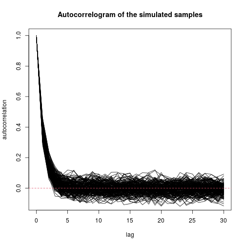

```r
mcmltime <- difftime(Sys.time(),tm,units = 'secs')
cat("MCML took: ",format(mcmltime),"\n")
```

```
## MCML took:  32.52503 secs
```

```r
tm <- Sys.time()
cat("Doing MCML Sims, time = ",format(tm),"\n")
```

```
## Doing MCML Sims, time =  2021-05-13 17:06:44
```

```r
tmp <- capture.output({
  preds_mcml <- spatial.pred.binomial.MCML(
    fit.MCML1,
    as.data.frame(raster(loaFit$raster$random.mean),xy=TRUE),
    control.mcmc = c.mcmc,
    type = 'marginal',
    scale.predictions = 'prevalence',
    standard.errors = TRUE,
    thresholds = .2,
    scale.thresholds = 'prevalence'
  )
})

# rasterize the grid
mcmcl_predraster <- raster(loaFit$raster$random.mean)
values(mcmcl_predraster) <- preds_mcml$prevalence$predictions
mcmlsimtime <- difftime(Sys.time(),tm,units = 'secs')
# save(fit.MCML1,preds_mcml,file = file.path(savepath,paste0("loaloamcml",savestamp,".RData")))
# raster::writeRaster(mcmcl_predraster,file.path(savepath,paste0("loaloamcml-preds",savestamp,".grd")),overwrite = TRUE)
cat("MCML Sims took: ",format(mcmlsimtime),"\n")
```

```
## MCML Sims took:  20.64649 secs
```

```r
## MCMC ----
tm <- Sys.time()
cat("Doing MCMC, time = ",format(tm),"\n")
```

```
## Doing MCMC, time =  2021-05-13 17:07:05
```

```r
# priors
lam <- -log(rho_alpha) * rho_u
thepriors <- control.prior(
  beta.mean = 0,
  beta.covar = 1/beta_prec,
  log.prior.sigma2 = function(x) stats::dexp(sqrt(x), rate=0.922219863528484,log = TRUE) - (1/2)*log(x),
  log.prior.phi = function(x) -2*log(x) + dexp(1/x,sqrt(8)*lam,log = TRUE),
  log.normal.nugget = c(-15,1e-06) # Basically no nugget
)

mcmc.Bayes <- control.mcmc.Bayes(
  n.sim = 6000, burnin = 1000, thin = 1,h.theta1 = 1, h.theta2 = 0.7, h.theta3 = 0.05,
  L.S.lim = c(5,50), epsilon.S.lim = c(0.03,0.06),
  start.beta = -2.3, 
  start.sigma2 = 2.6,
  start.phi = 0.8, 
  start.nugget = exp(-15),
  start.S = predict(initvaluemodel)
)

tmp <- capture.output({
  fit.Bayes <- binomial.logistic.Bayes(
    formula = y ~ 1,
    units.m = ~ N,
    coords = ~ long + lat,
    data = as.data.frame(loaloa), control.prior = thepriors,
    control.mcmc = mcmc.Bayes, kappa = maternconstants$nu)
  summary(fit.Bayes, hpd.coverage = 0.95)
})

mcmctime <- difftime(Sys.time(),tm,units = 'secs')
cat("MCMC took: ",format(mcmctime),"\n")
```

```
## MCMC took:  477.019 secs
```

```r
tm <- Sys.time()
cat("Doing MCMC Sims, time = ",format(tm),"\n")
```

```
## Doing MCMC Sims, time =  2021-05-13 17:15:02
```

```r
tmp <- capture.output({
  pred.Bayes <- spatial.pred.binomial.Bayes(
    fit.Bayes, 
    as.data.frame(raster(loaFit$raster$random.mean),xy=TRUE),
    type = "marginal",
    scale.predictions = "prevalence", quantiles = NULL,
    standard.errors = TRUE, thresholds = 0.2,
    scale.thresholds = "prevalence")
})

bayesian_predraster <- raster(loaFit$raster$random.mean)
values(bayesian_predraster) <- pred.Bayes$prevalence$predictions

mcmcsimtime <- difftime(Sys.time(),tm,units = 'secs')
# save(fit.Bayes,pred.Bayes,file = file.path(savepath,paste0("loaloamcmc",savestamp,".RData")))
# raster::writeRaster(bayesian_predraster,file.path(savepath,paste0("loaloamcmc-preds",savestamp,".grd")),overwrite = TRUE)
cat("MCMC Sims took: ",format(mcmcsimtime),"\n")
```

```
## MCMC Sims took:  2173.574 secs
```

```r
# Plot them!


br <- c(0,.05,.1,.15,.2,.25,.3,.4,.5,.6,1)

aghqpostmean <- calc(ilogit(simbrick),mean)

# png(file.path(plotpath,paste0("aghq-mean-map",savestamp,".png")))
plot_loaloa(aghqpostmean,br)
```

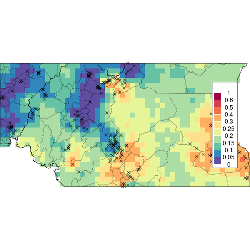

```r
# dev.off()

# png(file.path(plotpath,paste0("mcml-mean-map",savestamp,".png")))
plot_loaloa(mcmcl_predraster,br)
```

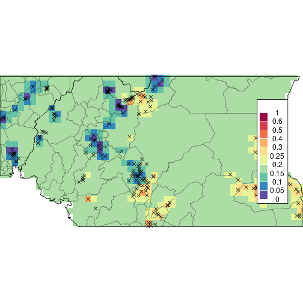

```r
# dev.off()

# png(file.path(plotpath,paste0("inla-mean-map",savestamp,".png")))
plot_loaloa(loaFit$raster$predict.invlogit,br)
```

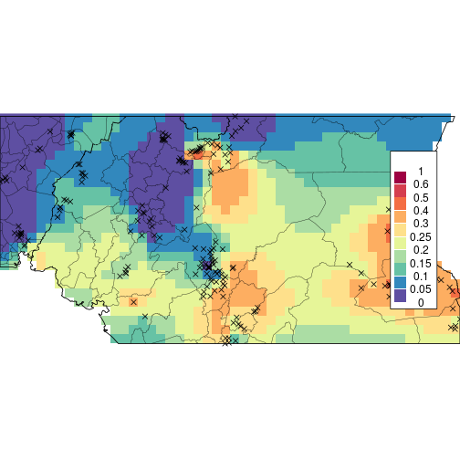

```r
# dev.off()

# png(file.path(plotpath,paste0("mcmc-mean-map",savestamp,".png")))
plot_loaloa(bayesian_predraster,br)
```


```r
# dev.off()
# difference
difftable <- data.frame(
  comparison = c('mean','max'),
  mcml_mcmc = c(
    mean(abs(values(mcmcl_predraster) - values(bayesian_predraster))),
    max(abs(values(mcmcl_predraster) - values(bayesian_predraster)))
  ),
  inla_mcmc = c(
    mean(abs(values(loaFit$raster$predict.invlogit) - values(bayesian_predraster))),
    max(abs(values(loaFit$raster$predict.invlogit) - values(bayesian_predraster)))
  ),
  inla_mcml = c(
    mean(abs(values(loaFit$raster$predict.invlogit) - values(mcmcl_predraster))),
    max(abs(values(loaFit$raster$predict.invlogit) - values(mcmcl_predraster)))
  ),
  aghq_mcml = c(
    mean(abs(values(aghqpostmean) - values(mcmcl_predraster))),
    max(abs(values(aghqpostmean) - values(mcmcl_predraster)))
  ),
  aghq_mcmc = c(
    mean(abs(values(aghqpostmean) - values(bayesian_predraster))),
    max(abs(values(aghqpostmean) - values(bayesian_predraster)))
  ),
  aghq_inla = c(
    mean(abs(values(aghqpostmean) - values(loaFit$raster$predict.invlogit))),
    max(abs(values(aghqpostmean) - values(loaFit$raster$predict.invlogit)))
  )
)
# readr::write_csv(difftable,file.path(savepath,paste0("diff-table-loaloa",savestamp,".csv")))
knitr::kable(difftable,digits = 3)
```


|comparison | mcml_mcmc| inla_mcmc| inla_mcml| aghq_mcml| aghq_mcmc| aghq_inla|
|:----------|---------:|---------:|---------:|---------:|---------:|---------:|
|mean       |     0.046|     0.030|     0.070|     0.048|     0.014|     0.033|
|max        |     0.218|     0.225|     0.249|     0.236|     0.101|     0.266|

```r
# covariance params
aghqsigmamean <- compute_moment(loaloaquad,function(x) get_sigma(exp(x[1]),exp(x[2])))
aghqrhomean <- compute_moment(loaloaquad,function(x) get_rho(exp(x[1]),exp(x[2])))
aghqlogsigmamean <- compute_moment(loaloaquad,function(x) log(get_sigma(exp(x[1]),exp(x[2]))))
aghqlogrhomean <- compute_moment(loaloaquad,function(x) log(get_rho(exp(x[1]),exp(x[2]))))

aghqlogsigmasd <- sqrt(compute_moment(loaloaquad,function(x) (log(get_sigma(exp(x[1]),exp(x[2]))) - aghqlogsigmamean)^2))
aghqlogrhosd <- sqrt(compute_moment(loaloaquad,function(x) (log(get_rho(exp(x[1]),exp(x[2]))) - aghqlogrhomean)^2))

covparamtable <- data.frame(
  method = c('AGHQ','INLA','MCML','MCMC'),
  sigmamean = c(
    aghqsigmamean,
    loaFit$parameters$summary$mean[3],
    exp(summary(fit.MCML1)$cov.par[1,1] / 2),
    mean(sqrt(fit.Bayes$estimate[ ,'sigma^2']))
  ),
  sigmalower = c(
    exp(aghqlogsigmamean - 2*aghqlogsigmasd),
    loaFit$parameters$summary$`0.025quant`[3],
    exp((summary(fit.MCML1)$cov.par[1,1] - 2*summary(fit.MCML1)$cov.par[1,2])/2),
    quantile(sqrt(fit.Bayes$estimate[ ,'sigma^2']),probs = .025)
  ),
  sigmaupper = c(
    exp(aghqlogsigmamean + 2*aghqlogsigmasd),
    loaFit$parameters$summary$`0.975quant`[3],
    exp((summary(fit.MCML1)$cov.par[1,1] + 2*summary(fit.MCML1)$cov.par[1,2])/2),
    quantile(sqrt(fit.Bayes$estimate[ ,'sigma^2']),probs = .975)
  ),
  
  rhomean = c(
    aghqrhomean,
    loaFit$parameters$summary$mean[2] * 1000,
    exp(summary(fit.MCML1)$cov.par[2,1]) * sqrt(8),
    mean(fit.Bayes$estimate[ ,'phi']) * sqrt(8)
  ),
  rholower = c(
    exp(aghqlogrhomean - 2*aghqlogrhosd),
    loaFit$parameters$summary$`0.025quant`[2] * 1000,
    exp((summary(fit.MCML1)$cov.par[2,1] - 2*summary(fit.MCML1)$cov.par[2,2]))*sqrt(8),
    quantile(fit.Bayes$estimate[ ,'phi'] * sqrt(8),probs = .025)
  ),
  rhoupper = c(
    exp(aghqlogrhomean + 2*aghqlogrhosd),
    loaFit$parameters$summary$`0.975quant`[2] * 1000,
    exp((summary(fit.MCML1)$cov.par[2,1] + 2*summary(fit.MCML1)$cov.par[2,2]))*sqrt(8),
    quantile(fit.Bayes$estimate[ ,'phi'] * sqrt(8),probs = .975)
  )
)
# readr::write_csv(covparamtable,file.path(savepath,paste0("covparam-table-loaloa",savestamp,".csv")))
knitr::kable(covparamtable,digits = 3)
```


|method | sigmamean| sigmalower| sigmaupper|   rhomean| rholower|  rhoupper|
|:------|---------:|----------:|----------:|---------:|--------:|---------:|
|AGHQ   |     1.479|      1.198|      1.808|  63918.42| 45431.71|  87531.22|
|INLA   |     2.060|      1.424|      3.073| 151928.75| 93809.99| 246066.09|
|MCML   |     1.402|      1.229|      1.599|  15666.12| 12336.35|  19894.64|
|MCMC   |     1.560|      1.262|      1.971|  68035.57| 48395.67|  95782.60|

```r
# Write the timing table
timingtable <- data.frame(
  task = c("AGHQ","INLA","MCML","MCMC","AGHQSim","MCMLSim","MCMCSim"),
  time = c(aghqtime,inlatime,mcmltime,mcmctime,aghqsimtime,mcmlsimtime,mcmcsimtime)
)
# readr::write_csv(timingtable,file.path(savepath,paste0("timing-table-loaloa",savestamp,".csv")))
knitr::kable(timingtable,digits = 3)
```


|task    |time          |
|:-------|:-------------|
|AGHQ    |107.151 secs  |
|INLA    |40.177 secs   |
|MCML    |32.525 secs   |
|MCMC    |477.019 secs  |
|AGHQSim |90.632 secs   |
|MCMLSim |20.646 secs   |
|MCMCSim |2173.574 secs |

```r
# Total and num iter
totaltable <- c(
  mcmc = as.numeric(timingtable[timingtable$task == 'MCMC','time']) + as.numeric(timingtable[timingtable$task == 'MCMCSim','time']),
  aghq = as.numeric(timingtable[timingtable$task == 'AGHQ','time']) + as.numeric(timingtable[timingtable$task == 'AGHQSim','time']),
  inla = as.numeric(timingtable[timingtable$task == 'INLA','time']),
  mcml = as.numeric(timingtable[timingtable$task == 'MCML','time']) + as.numeric(timingtable[timingtable$task == 'MCMLSim','time'])
)
effiter <- totaltable[2:4] * 6000 / totaltable[1]
effiter
```

```
##      aghq      inla      mcml 
## 447.70917  90.94732 120.36144
```

```r
#### END OF EXAMPLE 5.1 ####

## Example 5.2: Loaloa with zero-inflation

savestamp <- "20210505-v1"
plotpath <- file.path(globalpath,"loaloazip")
if (!dir.exists(plotpath)) dir.create(plotpath)
savepath <- plotpath

file.copy(system.file('extsrc/05_loaloazip.cpp',package='aghq'),globalpath)
```

```
## [1] TRUE
```

```r
# Compile TMB template-- only need to do once
compile(file.path(globalpath,"05_loaloazip.cpp"))
```

```
## [1] 0
```

```r
dyn.load(dynlib(file.path(globalpath,"05_loaloazip")))

# Initialize time variables
aghqtime <- 0
aghqsimtime <- 0
mcmctime <- 0
mcmcsimtime <- 0

## Prepare the "inner" model ##

# Design matrices
Amat <- Diagonal(nrow(loaloa))

Xmat <- cbind(rep(1,nrow(Amat)))
# Design matrix: zip model and risk model are the same
design <- bdiag(
  # ZIP
  cbind(
    Amat,
    Xmat
  ),
  # Risk
  cbind(
    Amat,
    Xmat
  )
)

# Response
y <- loaloa@data$y
N <- loaloa@data$N

## Dimensions
n <- nrow(Xmat) # Number of obs
p <- ncol(Xmat) * 2 # Number of betas
m <- ncol(Amat) * 2 # Number of spatial points
Wd <- ncol(design) # Number of total params
# Check
stopifnot(Wd == m + p)

## Prior distributions ##
# Use the same prior for both sets of Matern params
sigma_u <- 1
sigma_alpha <- .025
rho_u <- 2e05
rho_alpha <- .975

# PC Prior for kappa,tau
maternconstants <- list()
maternconstants$d <- 2 # Dimension of spatial field, fixed
maternconstants$nu <- 1 # Shape param, fixed
get_kappa <- function(sigma,rho) sqrt(8*maternconstants$nu)/rho
get_tau <- function(sigma,rho) sigma * get_kappa(sigma,rho)^(maternconstants$nu) * sqrt(gamma(maternconstants$nu + maternconstants$d/2) * (4*pi)^(maternconstants$d/2) / gamma(maternconstants$nu))
get_sigma <- function(kappa,tau) tau / (kappa^(maternconstants$nu) * sqrt(gamma(maternconstants$nu + maternconstants$d/2) * (4*pi)^(maternconstants$d/2) / gamma(maternconstants$nu)))
get_rho <- function(kappa,tau) sqrt(8*maternconstants$nu) / kappa

# Precision for betas

beta_prec <- .001

## Log Posterior ----

startingsig <- 1
startingrho <- 4.22*1e04

datlist <- list(
  y = y,
  N = N,
  design = design,
  nu = maternconstants$nu,
  rho_u = rho_u,
  rho_alpha = rho_alpha,
  sigma_u = sigma_u,
  sigma_alpha = sigma_alpha,
  D = raster::pointDistance(loaloa,lonlat = FALSE),
  betaprec = beta_prec
)
# NOTE: for some initial values of W, TMB's inner optimization seems to fail
# This was tried over a bunch of random intializations and most worked, and all
# gave the same optimum. But this is why we set the seed here and use a random start.
set.seed(4564)
paraminit <- list(
  W = rnorm(ncol(design)),
  logkappa = log(get_kappa(startingsig,startingrho)),
  logtau = log(get_tau(startingsig,startingrho))
)

ff <- MakeADFun(data = datlist,
                parameters = paraminit,
                random = "W",
                DLL = "05_loaloazip",
                ADreport = FALSE,
                silent = TRUE)

tm <- Sys.time()
cat("Doing AGHQ, time = ",format(tm),"\n")
```

```
## Doing AGHQ, time =  2021-05-13 17:51:41
```

```r
loaloazipquad <- aghq::marginal_laplace_tmb(
  ff,
  3,
  startingvalue = c(paraminit$logkappa,paraminit$logtau)
)
aghqtime <- difftime(Sys.time(),tm,units = 'secs')
# save(loaloazipquad,file = file.path(savepath,paste0("loaloazipquad",savestamp,".RData")))
cat("AGHQ took: ",format(aghqtime),"\n")
```

```
## AGHQ took:  88.57477 secs
```

```r
simulate_spatial_fields <- function(U,
                                    theta,
                                    pointsdata,
                                    resolution = list(nrow = 100,ncol = 100)) {
  # U: matrix of samples, each column is a sample
  # theta: data.frame of theta values
  # Draw from U*|U
  
  # Compute matrix of var, range, shape
  modpar <- cbind(
    var = get_sigma(exp(theta$theta1),exp(theta$theta2))^2,
    range = get_rho(exp(theta$theta1),exp(theta$theta2)),
    shape = maternconstants$nu
  )
  
  fielddat <- pointsdata
  fielddat@data <- as.data.frame(U)
  
  geostatsp::RFsimulate(
    model = modpar,
    data = fielddat,
    x = raster(fielddat,nrows = resolution$nrow,ncols = resolution$ncol)
  )
}

## Post samples ----

cat("Doing AGHQ field simulations, time = ",format(tm),"\n")
```

```
## Doing AGHQ field simulations, time =  2021-05-13 17:51:41
```

```r
loazippostsamples <- sample_marginal(loaloazipquad,100)
# Extract out the U and V
postU <- loazippostsamples$samps[c(1:190), ]
postV <- loazippostsamples$samps[c(192:381), ]

postBeta <- loazippostsamples$samps[c(191,382), ]

tm <- Sys.time()
fieldbrickzip <- simulate_spatial_fields(
  postU,
  loazippostsamples$theta,
  loaloa,
  resolution = reslist
)
fieldbrickrisk <- simulate_spatial_fields(
  postV,
  loazippostsamples$theta,
  loaloa,
  resolution = reslist
)

fieldbrickzip_withint <- fieldbrickzip + postBeta[1, ]
fieldbrickrisk_withint <- fieldbrickrisk + postBeta[2, ]

simfieldsmeanzip <- mean(1 / (1 + exp(-fieldbrickzip_withint)))

simfieldsmeanrisk <- mean(
  (1 / (1 + exp(-fieldbrickzip_withint))) *
    (1 / (1 + exp(-fieldbrickrisk_withint)))
)
aghqsimtime <- difftime(Sys.time(),tm,units = 'secs')
# raster::writeRaster(fieldbrickzip,file.path(savepath,paste0("fieldbrickzipaghq",savestamp,".grd")),overwrite = TRUE)
# raster::writeRaster(fieldbrickrisk,file.path(savepath,paste0("fieldbrickzipaghq",savestamp,".grd")),overwrite = TRUE)

# cameroonBorderLL = raster::getData("GADM", country=c('CMR'), level=2)
# nigeriaBorderLL = raster::getData("GADM", country=c('NGA'), level=2)
# cameroonBorder = spTransform(cameroonBorderLL, projection(loaloa))
# nigeriaBorder = spTransform(nigeriaBorderLL, projection(loaloa))
# cameroonBorderouter <- rgeos::gUnaryUnion(cameroonBorder)
# nigeriaBorderouter <- rgeos::gUnaryUnion(nigeriaBorder)
# 
# 
# fullborder <- raster::bind(cameroonBorder,nigeriaBorder)
# fullborderouter <- raster::bind(cameroonBorderouter,nigeriaBorderouter)
# 
# fullborder <- crop(fullborder,loaloa)
# fullborderouter <- crop(fullborderouter,loaloa)

plot_loaloa <- function(plotraster,breaks) {
  predcols <- mapmisc::colourScale(
    plotraster,
    breaks = breaks,
    style = "fixed",
    col = "Spectral",
    rev = TRUE
  )
  
  plotraster <- mask(plotraster,fullborderouter)
  
  mapmisc::map.new(loaloa)
  plot(plotraster,
       col = predcols$col,
       breaks = predcols$breaks,
       legend=FALSE, add=TRUE)
  points(loaloa,pch = 4)
  plot(fullborder,add = TRUE,border=mapmisc::col2html("black", 0.5), lwd=0.5)
  plot(fullborderouter,add = TRUE)
  mapmisc::legendBreaks('right', predcols, cex=1, bty='o',inset = .05)
}

br <- c(0,.05,.1,.15,.2,.25,.3,.4,.5,.6,1)
brzero <- c(.35,.5,.6,.7,.8,.9,.91,.92,.93,.94,.95,1)

# pdf(file.path(plotpath,paste0("loaloa-zip-postmean.pdf")),width=7,height=7)
plot_loaloa(simfieldsmeanzip,brzero)
```

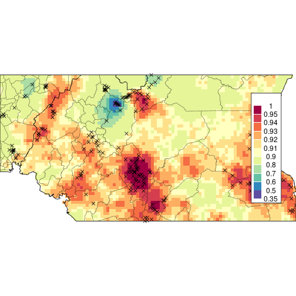

```r
# dev.off()
# pdf(file.path(plotpath,paste0("loaloa-risk-postmean.pdf")),width=7,height=7)
plot_loaloa(simfieldsmeanrisk,br)
```

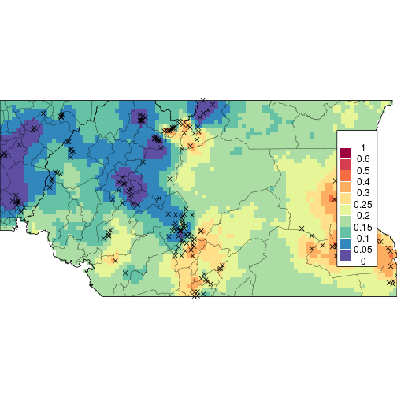

```r
# dev.off()
cat("AGHQ simulations took: ",format(aghqsimtime),"\n")
```

```
## AGHQ simulations took:  352.062 secs
```

```r
# Write the timing table
timingtable <- data.frame(
  task = c("AGHQ","MCMC","AGHQSim","MCMCSim"),
  time = c(aghqtime,mcmctime,aghqsimtime,mcmcsimtime)
)
# readr::write_csv(timingtable,file.path(savepath,paste0("timing-table",savestamp,".csv")))
knitr::kable(timingtable,digits = 3)
```


|task    |time         |
|:-------|:------------|
|AGHQ    |88.575 secs  |
|MCMC    |0.000 secs   |
|AGHQSim |352.062 secs |
|MCMCSim |0.000 secs   |

```r
#### END EXAMPLE 5.2 ####

## Example 6.1: the zero-inflated overdispersed Poisson from glmmTMB ----

plotpath <- file.path(globalpath,"poisson-zip")
if (!dir.exists(plotpath)) dir.create(plotpath)

savestamp <- "-2021-05-06"

## ZIP example from glmmTMB ##
data("Salamanders",package = "glmmTMB")
# First, fit the model for real
tm <- Sys.time()
zipmod <- glmmTMB(
  count ~ mined + (1|site),
  zi = ~mined,
  disp = ~DOY,
  data = Salamanders,
  family = nbinom2,
  doFit = TRUE
)
```

```
## Warning in Matrix::sparseMatrix(dims = c(0, 0), i = integer(0), j =
## integer(0), : 'giveCsparse' has been deprecated; setting 'repr = "T"' for you
```

```
## Warning in Matrix::sparseMatrix(dims = c(0, 0), i = integer(0), j =
## integer(0), : 'giveCsparse' has been deprecated; setting 'repr = "T"' for you

## Warning in Matrix::sparseMatrix(dims = c(0, 0), i = integer(0), j =
## integer(0), : 'giveCsparse' has been deprecated; setting 'repr = "T"' for you
```

```r
glmmTMBtime <- difftime(Sys.time(),tm,units = 'secs')
# glmmTMB creates all the necessary information
zipmodinfo <- glmmTMB(
  count ~ mined + (1|site),
  zi = ~mined,
  disp = ~DOY,
  data = Salamanders,
  family = nbinom2,
  doFit = FALSE
)
```

```
## Warning in Matrix::sparseMatrix(dims = c(0, 0), i = integer(0), j =
## integer(0), : 'giveCsparse' has been deprecated; setting 'repr = "T"' for you

## Warning in Matrix::sparseMatrix(dims = c(0, 0), i = integer(0), j =
## integer(0), : 'giveCsparse' has been deprecated; setting 'repr = "T"' for you

## Warning in Matrix::sparseMatrix(dims = c(0, 0), i = integer(0), j =
## integer(0), : 'giveCsparse' has been deprecated; setting 'repr = "T"' for you
```

```r
# Use this to create the TMB template
ff <- with(zipmodinfo,{
  MakeADFun(
    data = data.tmb,
    parameters = parameters,
    random = names(parameters)[grep('theta',names(parameters),invert = TRUE)],
    DLL = "glmmTMB",
    silent = TRUE
  )
})

# Fit using AGHQ
tm <- Sys.time()
zipquad <- marginal_laplace_tmb(ff,3,0)
zipquadsamps <- sample_marginal(zipquad,1e03)
zipsigmapdf <- compute_pdf_and_cdf(
  zipquad,list(totheta = log,fromtheta = exp),
  finegrid = seq(-10,0.2,length.out = 1000)
)
aghqtime <- difftime(Sys.time(),tm,units = 'secs')

# plot
# pdf(file.path(plotpath,paste0("sigma-plot-aghq",savestamp,".pdf")),width = 7,height = 7)
with(zipsigmapdf[[1]],plot(transparam,pdf_transparam,type='l',main='',ylab='',xlab=expression(sigma),xaxt='n',xlim = c(0,1.2),ylim = c(0,3),cex.lab=1.5,cex.axis = 1.5))
title(ylab="Density",cex.lab=1.5,line=2.3)
axis(1,cex.axis=1.5,at=seq(0,1.2,by=.2))
abline(v = sqrt(as.numeric(summary(zipmod)$varcor$cond$site)),lty='dashed')
```

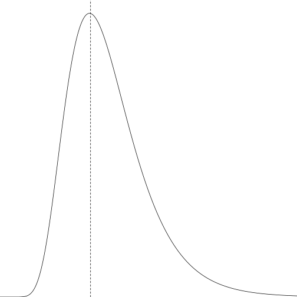

```r
# dev.off()

# confidence/credible intervals for random effects
rr <- as.data.frame(ranef(zipmod,condVar = TRUE))
Usamps <- zipquadsamps$samps[rownames(zipquadsamps$samps) == 'b', ]
Uest <- apply(Usamps,1,mean)
Ulower <- apply(Usamps,1,quantile,probs = .025)
Uupper <- apply(Usamps,1,quantile,probs = .975)

xx <- 1:nrow(rr)
offset <- .2
# pdf(file.path(plotpath,paste0("interval-plot-aghq",savestamp,".pdf")),width = 7,height = 7)
with(rr,plot(xx-offset,condval,type = 'p',pch=20,xaxt='n',xlab='Site',ylab='',ylim = c(-1.7,1.7)))
points(xx+offset,Uest,type='p',pch=20)
with(rr,axis(1,at = xx,labels = as.character(grp)))
with(rr,arrows(x0=xx-offset,y0=condval-qnorm(.975)*condsd,y1=condval+qnorm(.975)*condsd,length=.05,angle=90,code=3))
arrows(x0=xx+offset,y0=Ulower,y1=Uupper,length=.05,angle=90,code=3)
```

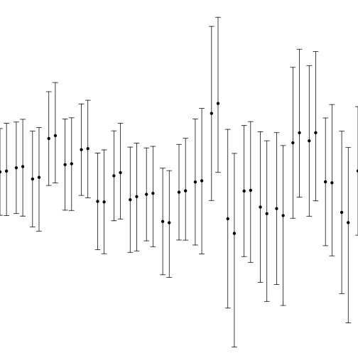

```r
# dev.off()

#### END EXAMPLE 6.1 ####

## Example 2: Basic Use ----

plotpath <- file.path(globalpath,"basic-use")
if (!dir.exists(plotpath)) dir.create(plotpath)

set.seed(84343124)
y <- rpois(10,5) # True lambda = 5, n = 10


# Define the log posterior, log(pi(theta,y)) here
logpithetay <- function(theta,y) {
  sum(y) * theta - (length(y) + 1) * exp(theta) - sum(lgamma(y+1)) + theta
}
objfunc <- function(x) logpithetay(x,y)
objfuncgrad <- function(x) numDeriv::grad(objfunc,x)
objfunchess <- function(x) numDeriv::hessian(objfunc,x)
# Now create the list to pass to aghq()
funlist <- list(
  fn = objfunc,
  gr = objfuncgrad,
  he = objfunchess
)

# AGHQ with k = 3
# Use theta = 0 as a starting value
thequadrature <- aghq::aghq(ff = funlist,k = 3,startingvalue = 0)

summary(thequadrature)
```

```
## AGHQ on a 1 dimensional posterior with  3 quadrature points
## 
## The posterior mode is: 1.493925 
## 
## The log of the normalizing constant/marginal likelihood is: -23.32123 
## 
## The posterior Hessian at the mode is:
##      [,1]
## [1,]   49
## 
## The covariance matrix used for the quadrature is...
##            [,1]
## [1,] 0.02040816
## 
## ...and its Cholesky is:
##           [,1]
## [1,] 0.1428571
## 
## Here are some moments and quantiles for theta:
## 
##            mean   median     mode        sd     2.5%    97.5%
## theta1 1.483742 1.482532 1.493925 0.1424943 1.204135 1.762909
```

```r
plot(thequadrature)
```

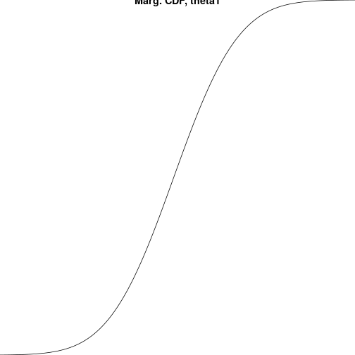

```r
# The posterior
thequadrature$normalized_posterior$nodesandweights
```

```
##     theta1   weights   logpost logpost_normalized
## 1 1.246489 0.2674745 -23.67784         -0.3566038
## 2 1.493925 0.2387265 -22.29426          1.0269677
## 3 1.741361 0.2674745 -23.92603         -0.6047982
```

```r
# The log normalization constant:
thequadrature$normalized_posterior$lognormconst
```

```
## [1] -23.32123
```

```r
# Compare to the truth: 
lgamma(1 + sum(y)) - (1 + sum(y)) * log(length(y) + 1) - sum(lgamma(y+1))
```

```
## [1] -23.31954
```

```r
# Quite accurate with only n = 10 and k = 3; this example is very simple.
# The mode found by the optimization:
thequadrature$optresults$mode
```

```
## [1] 1.493925
```

```r
# The true mode:
log((sum(y) + 1)/(length(y) + 1))
```

```
## [1] 1.493925
```

```r
# Compute the pdf for theta
transformation <- list(totheta = log,fromtheta = exp)
pdfwithlambda <- compute_pdf_and_cdf(
  thequadrature,
  transformation = transformation
)[[1]]
head(pdfwithlambda,n = 2)
```

```
##       theta         pdf          cdf transparam pdf_transparam
## 1 0.9990534 0.008604132 0.000000e+00   2.715710    0.003168281
## 2 1.0000441 0.008809832 8.728201e-06   2.718402    0.003240813
```

```r
lambdapostsamps <- sample_marginal(thequadrature,1e04,transformation = transformation)[[1]]
# Plot along with the true posterior
# pdf(file = file.path(plotpath,'lambda-post-plot.pdf'))
with(pdfwithlambda,{
  hist(lambdapostsamps,breaks = 50,freq = FALSE,main = "",xlab = expression(lambda))
  lines(transparam,pdf_transparam)
  lines(transparam,dgamma(transparam,1+sum(y),1+length(y)),lty='dashed')
})
```

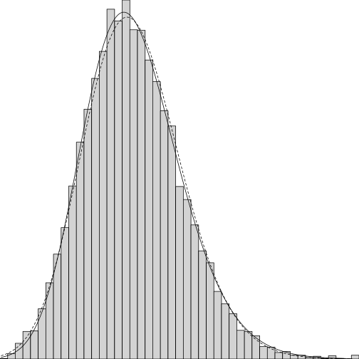

```r
# dev.off()

# Check if the posterior integrates to 1, by computing the "moment" of "1":
compute_moment(thequadrature$normalized_posterior,
               ff = function(x) 1)
```

```
## [1] 1
```

```r
# Posterior mean for theta:
compute_moment(thequadrature$normalized_posterior,
               ff = function(x) x)
```

```
## [1] 1.483742
```

```r
# Posterior mean for lambda = exp(theta)
compute_moment(thequadrature$normalized_posterior,
               ff = function(x) exp(x))
```

```
## [1] 4.454407
```

```r
# Compare to the truth:
(sum(y) + 1)/(length(y) + 1)
```

```
## [1] 4.454545
```

```r
# Quantiles
compute_quantiles(
  thequadrature,
  q = c(.01,.25,.50,.75,.99),
  transformation = transformation
)[[1]]
```

```
##       1%      25%      50%      75%      99% 
## 3.166469 4.000544 4.404081 4.848323 6.149735
```

```r
# The truth:
qgamma(c(.01,.25,.50,.75,.99),1+sum(y),1+length(y))
```

```
## [1] 3.108896 4.010430 4.424279 4.865683 6.067076
```

